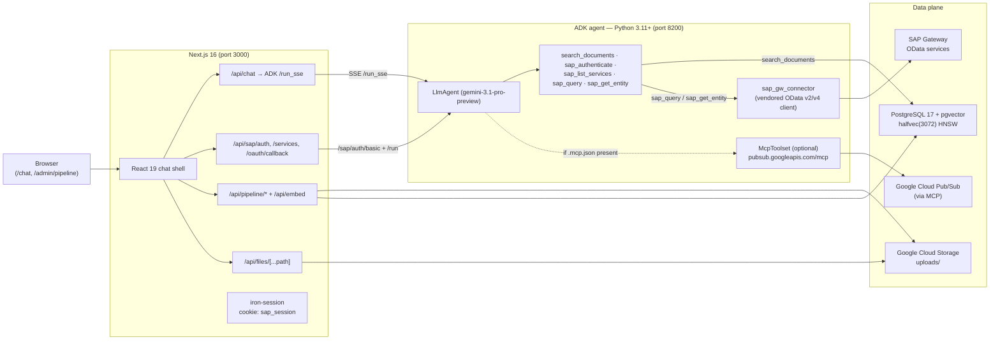
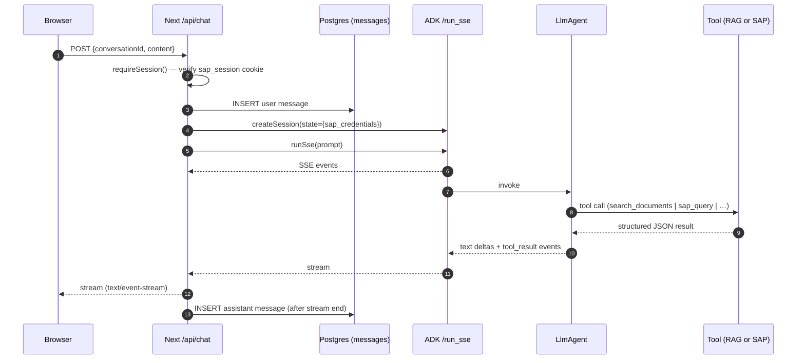
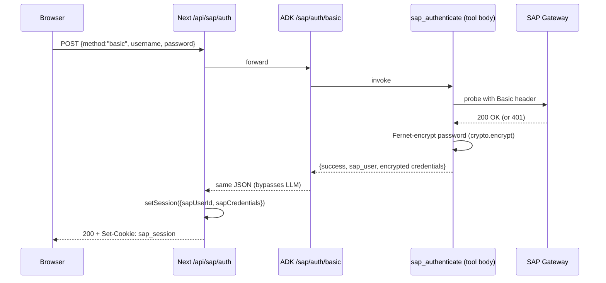
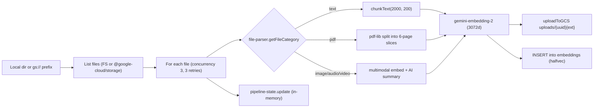
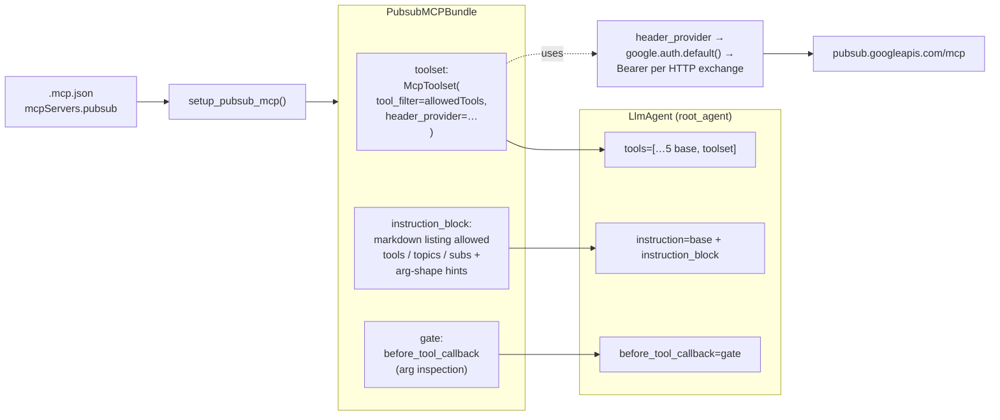
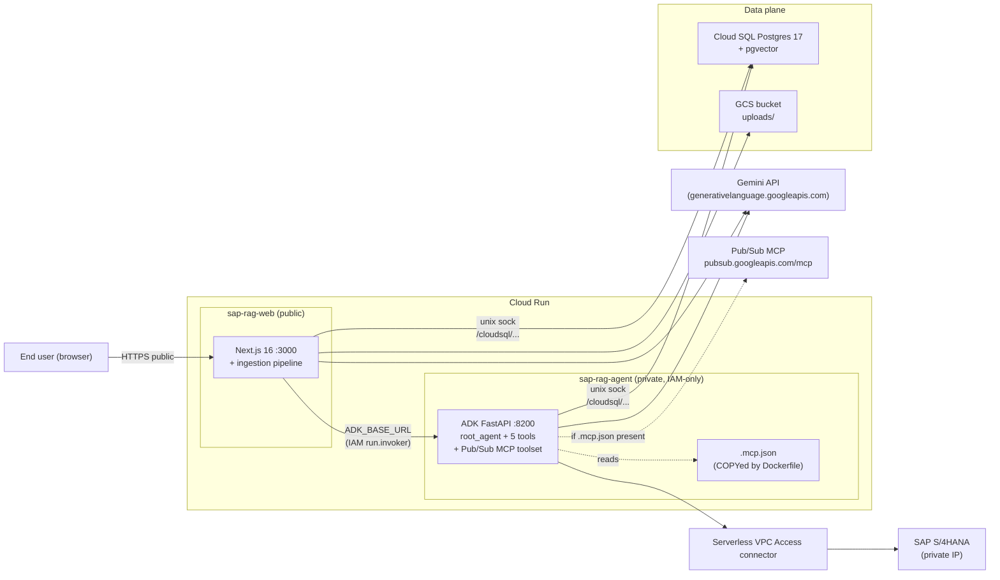
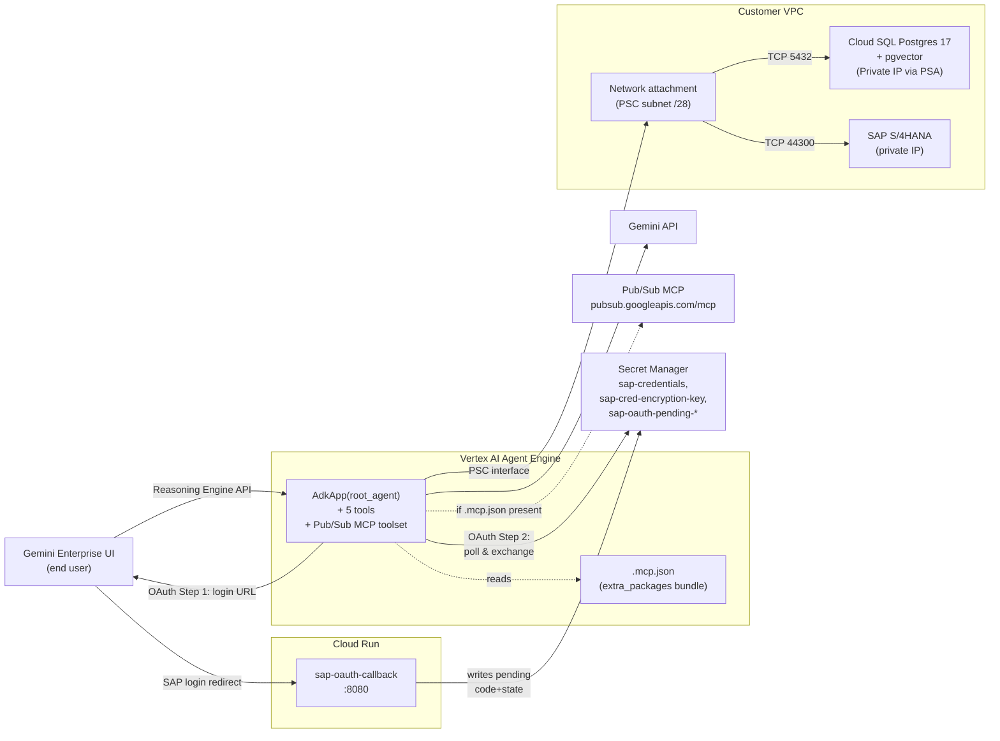

# Architecture

## 1. Runtime topology

Two long-running processes plus PostgreSQL and Google Cloud Storage. The
Next.js app holds **no agent logic** — every chat turn is proxied to the ADK
agent over SSE.



**No standalone SAP sidecar.** The previous `sap-service/` FastAPI process
(port 8100) was removed; SAP Gateway calls now happen in-process inside the
ADK agent via the vendored `adk_agent/sap_gw_connector` package.

## 2. Tech stack layers

| Layer | Technology |
|-------|------------|
| Chat UI | Next.js 16 (App Router, Turbopack), React 19, Tailwind 4, shadcn/ui |
| Streaming + ingestion API | Next.js Route Handlers (`runtime='nodejs'`, `maxDuration` up to 300s) |
| Agent | Google ADK Python (`google-adk>=1.27`), `LlmAgent` with 5 tools, optional MCP toolset |
| Agent transport | FastAPI built by `google.adk.cli.fast_api.get_fast_api_app`, SSE on `/run_sse` |
| LLM | `gemini-3.1-pro-preview` (override via `SAP_AGENT_MODEL`) |
| Embedding | `gemini-embedding-2` (both ingestion and ADK query path); produces 3072-dim vectors |
| Vector store | PostgreSQL 17 + `pgvector` with `halfvec(3072)` and HNSW index |
| File storage | Google Cloud Storage; served back via `/api/files/...` with traversal guard |
| Auth (web) | iron-session cookie `sap_session` (8 h); separate `sap_oauth_pending` cookie (10 m) |
| Auth (SAP) | Basic and OAuth 2.0 + PKCE; SAP creds Fernet-encrypted via `SAP_CRED_ENCRYPTION_KEY` and stored in ADK session state |
| Optional MCP | Google Cloud Pub/Sub HTTP MCP, deny-by-default allowlists |
| Logging | `pino` (Next) + `structlog` (ADK), JSON to file + optional pretty stdout |

## 3. Data flow: chat turn (RAG and/or SAP)



The Next.js layer:
- Parses SSE chunks (`src/lib/adk-client.ts`), normalises Gemini `parts[]`
  into a flat `{type: text_delta | tool_call | tool_result | error}` event
  stream, and **drops** the `partial:false` aggregate text frame to avoid
  duplicating content.
- Persists the user message before invoking ADK and persists the assistant
  message after the stream finishes; auto-titles the conversation on first
  turn.
- Scopes the entire transaction to the `sap_user_id` taken from the
  `sap_session` cookie (see `src/lib/session.ts`).

## 4. Data flow: SAP authentication

### 4.1 Basic auth



The credential blob handed back to Next.js contains the Fernet-encrypted
password, never the plain one. Subsequent chat turns seed it back into the
ADK session state so `sap_query`/`sap_get_entity` can decrypt at call time
inside `_client_for` (see `adk_agent/tools/query_tool.py`).

### 4.2 OAuth 2.0 + PKCE

```mermaid
sequenceDiagram
  participant U as Browser
  participant L as LlmAgent
  participant Auth as sap_authenticate
  participant SAP as SAP /oauth
  participant N as Next /api/sap/oauth/callback

  Note over U,L: Mid-chat, the LLM detects SAP is required<br/>and there are no creds
  L->>Auth: sap_authenticate(method="oauth", user_id)
  Auth-->>L: {success:false, action_required:"sap_login", login_url, oauth_state}
  L-->>U: surfaces login_url verbatim (per system prompt)
  U->>SAP: opens login_url, authenticates
  SAP-->>U: redirect to /api/sap/oauth/callback?code&state
  U->>N: GET callback
  N->>N: validate state vs sap_oauth_pending cookie
  Note over N: Step-2 token exchange wiring is currently a TODO;<br/>callback fails closed.
```

The callback page (`src/app/api/sap/oauth/callback/route.ts`) currently
**fails closed** — it returns a popup HTML that posts a failure message back
to the parent window. Wiring it through to the ADK Step-2 endpoint
(`adk_agent/oauth.exchange_code`) is the open follow-up tracked in
[`docs/followups/post-migration.md`](../followups/post-migration.md).

## 5. Data flow: ingestion pipeline



`src/lib/embedding-ingest.ts` is the entry; everything downstream runs in the
Next.js process. The ADK agent's RAG tool only reads from the same
`embeddings` table — it does not write.

## 6. Database schema

| Table | Key columns | Notes |
|-------|-------------|-------|
| `embeddings` | `id`, `file_name`, `file_type`, `file_path`, `chunk_index`, `chunk_text`, `content_summary`, `embedding vector(3072)`, `metadata jsonb` | HNSW halfvec index for cosine search; `file_name` index for filename-aware lookups |
| `conversations` | `id`, `sap_user_id varchar(255)`, `title`, timestamps | Composite index `(sap_user_id, updated_at desc)` — every list/delete is scoped per SAP user |
| `messages` | `id`, `conversation_id` (FK CASCADE), `role`, `content`, `file_name`, `attachments jsonb`, `created_at` | Index `(conversation_id, created_at)` |

All three tables are created by `pnpm db:setup`. For legacy DBs without the
`sap_user_id` column on `conversations`, run `pnpm db:migrate:sap-user-id`.

## 7. Component hierarchy (Next.js)

```
src/app/
├── layout.tsx                      # root html + font wiring
├── page.tsx                        # redirect('/chat')
├── chat/page.tsx                   # shell: <ChatSidebar/> + <ChatWindow/> + <ChatInput/>
└── admin/pipeline/page.tsx         # <PipelineDashboard/>

src/components/
├── ChatSidebar.tsx                 # conversation list, new/select/delete, logout
├── ChatWindow.tsx                  # markdown stream, copy buttons, attachment grid, inline SAP login form
├── ChatInput.tsx                   # textarea + paperclip
├── SAPDataView.tsx                 # generic record-array → table renderer (used in chat results)
├── PipelineDashboard.tsx           # source-path input + folder upload + status polling
└── ui/                             # shadcn primitives
```

## 8. ADK agent internals

```
adk_agent/
├── agent.py            # LlmAgent (model, system prompt, tool registration order, before_tool_callback)
├── server.py           # build_app() → FastAPI + /healthz + /sap/auth/basic
├── settings.py         # frozen-dataclass; REQUIRED = [DATABASE_URL, SAP_HOST, EMBED_MODEL, EMBED_OUTPUT_DIM, SAP_CRED_ENCRYPTION_KEY]
├── probes.py           # 4 startup probes (yaml, db, embed model, secret manager)
├── mcp_pubsub.py       # Pub/Sub MCP toolset + deny-by-default before_tool_callback
├── oauth.py            # build_login_url, exchange_code (PKCE)
├── crypto.py           # Fernet singleton: encrypt(), decrypt()
├── services.yaml       # SAP catalog: 4 OData services + entities + key fields
├── rag/
│   ├── db.py           # asyncpg pool; SELECT … 1 - (embedding <=> $1::vector) AS score …
│   └── embedding.py    # genai.aio.models.embed_content (RETRIEVAL_QUERY task type)
└── tools/              # 5 callables; tool_context.state seeded by Next.js per turn
```

### Tool registration order (`agent.py`)

1. `search_documents`
2. `sap_authenticate`
3. `sap_list_services`
4. `sap_query`
5. `sap_get_entity`
6. *(optional)* `McpToolset(pubsub …)` if `setup_pubsub_mcp()` returns a bundle

The system prompt explicitly instructs the LLM to:
- Route doc questions to `search_documents` and SAP questions to `sap_query`.
- Surface `action_required` envelopes verbatim (and present `login_url` to
  the user when present).
- Render SAP results as markdown tables; cite the `source` field for RAG.

### Auth gating in tools

`sap_query` and `sap_get_entity` short-circuit when
`tool_context.state["sap_credentials"]` is missing:

```json
{ "success": false, "action_required": "sap_login", "error": "not_authenticated" }
```

On `SAPAuthenticationError` (e.g. expired token) the envelope becomes
`action_required: "re_authenticate"` so the front-end can prompt the user
to re-login. Other failures return a structured error envelope (see
[API.md](./API.md#sap_query)).

## 9. Pub/Sub MCP toolset

When `.mcp.json` defines a valid `mcpServers.pubsub` HTTP entry,
`adk_agent/mcp_pubsub.py:setup_pubsub_mcp()` produces a `PubsubMCPBundle`
with three artifacts that wire into the `LlmAgent` in different slots:



- `toolset` — `McpToolset(StreamableHTTPConnectionParams, tool_filter=allowed_tools, header_provider=…)`. The `header_provider` requests an ADC token for `https://www.googleapis.com/auth/pubsub` per HTTP exchange, so token refresh happens transparently — the toolset never has to be rebuilt.
- `instruction_block` — a markdown system-prompt section listing the
  allowed tools, topics, and subscriptions plus arg-shape hints (bare
  `projectId` strings, base64-encoded `data` for `publish`). Concatenated
  to the agent instruction. Without it the LLM has to discover the
  conventions through tool errors; with it the model usually picks
  valid args on the first try.
- `gate` — the `before_tool_callback`. It inspects the tool args for any of
  `topicId / topic / topicName / topic_name` (and the subscription
  variants), strips `projects/X/topics/` and `topics/` prefixes via
  `_extract_bare_name`, and rejects unmatched values with
  `{"isError": true, "content":[{"type":"text","text":"Access denied: …"}]}`.
  See [MCP.md "Gate decision flow"](./MCP.md#gate-decision-flow) for the
  full evaluation order.

**Deny-by-default policy**:

| `.mcp.json` field | Effect when missing/empty |
|-------------------|--------------------------|
| `allowedTools` | 0 Pub/Sub tools exposed to the LLM |
| `allowedTopics` | every call carrying a `topicId` arg is rejected |
| `allowedSubscriptions` | every call carrying a `subscriptionId` arg is rejected |

Caller principal must hold both `roles/mcp.toolUser` (gates the
`mcp.tools.call` permission) and `roles/pubsub.editor` (or finer-grained
Pub/Sub roles). For local dev, `gcloud auth application-default login` once
is sufficient; for Cloud Run, attach the roles to the runtime service
account.

## 10. Logging and request context

| Process | Logger | File |
|---------|--------|------|
| Next.js | pino, optional `pino-pretty` stdout | `${LOG_DIR ?? './logs'}/{service}.log` |
| ADK agent | `structlog` JSON | stdout (collected by Cloud Run / Docker) |

Both honour `LOG_LEVEL` (`debug | info | warn | error`) and `LOG_PAYLOAD`
(`meta | full` — controls how much SAP response body is captured).

`src/lib/request-context.ts` uses `AsyncLocalStorage` to attach
`{requestId, conversationId}` to every log line emitted during a single
chat turn. Sensitive fields (`Authorization`, `Set-Cookie`, `Cookie`,
`access_token`, `refresh_token`, `password`) are redacted by the pino
config in `src/lib/logger.ts`.

## 11. Security architecture

- **Session signing.** `iron-session` signs the `sap_session` and
  `sap_oauth_pending` cookies with `SAP_SESSION_SECRET` (≥ 32 chars).
  `httpOnly`, `sameSite=lax`, `secure` only in production.
- **SAP credentials at rest.** Basic-auth passwords are Fernet-encrypted
  with `SAP_CRED_ENCRYPTION_KEY` before they leave the ADK process. The
  iron-session cookie carries the encrypted blob; the ADK tool decrypts at
  call time.
- **GCS proxy.** `src/lib/gcs.ts:downloadFromGCS` enforces a hard
  `uploads/` prefix and rejects any path containing `..`. The `/api/files`
  route serves with `Cache-Control: public, max-age=86400`.
- **CSP and headers.** `next.config.ts` ships strict CSP, `X-Frame-Options
  DENY`, `nosniff`, and HSTS-style options.
- **Auth gate.** Setting `REQUIRE_AUTH=true` in `.env.local` causes
  `src/proxy.ts` (Next 16's renamed middleware) to gate `/api/chat`,
  `/api/embed`, `/api/conversations`, `/api/pipeline/*`, `/api/files/*`,
  and `/api/sap/services` at the proxy layer in addition to per-handler
  `requireSession()`. `/api/sap/auth` is intentionally excluded so users
  can log in.
- **Pub/Sub allowlist.** Deny-by-default gate (see §9) prevents the LLM
  from touching topics/subscriptions outside the curated set, even if the
  upstream MCP exposes more.

## 12. Operational notes

- Both processes are stateless except for `pipeline-state.ts`
  (in-memory ingestion progress, lost on restart) and the in-memory
  ADK session backend (`ADK_SESSION_BACKEND=memory` default). For
  production, switch ADK to `vertex` so sessions persist across replicas.
- HMR-aware singletons for `db.ts`, `logger.ts`, `gemini.ts`, `gcs.ts` are
  **not yet applied** — long dev sessions accumulate Postgres pools and
  log streams. Tracked in CLAUDE.md.
- Predev guard `scripts/check-parent-workspace.mjs` refuses to start
  `next dev` when a workspace marker (`package.json`, `*-lock.*`,
  `pnpm-workspace.yaml`) appears in the parent directory — see CLAUDE.md
  for the full Turbopack CSS-resolver bug story and
  [`docs/issues/2026-04-29-nextjs-turbopack-css-resolver-bug.md`](../issues/2026-04-29-nextjs-turbopack-css-resolver-bug.md)
  for the upstream draft.

For deployment specifics see [DEPLOYMENT.md](./DEPLOYMENT.md). For full
endpoint payloads see [API.md](./API.md).

## 13. Deployment topologies

The runtime topology in §1 shows the **local development** layout. Two
production topologies are scripted in `deploy/`. Both share one Cloud
SQL Postgres + pgvector instance; how `.mcp.json` and the MCP toolset
travel into the runtime differs per mode.

For the deploy scripts and step-by-step walkthroughs see
[`deploy/README.md`](../../deploy/README.md). For MCP-specific wiring
across modes see [MCP.md](./MCP.md).

### 13.1 Mode A — Cloud Run × 2

Both services share one Cloud SQL via the unix socket the runtime
mounts at `/cloudsql/<conn>`. Only the agent service needs the VPC
connector to reach SAP S/4HANA on its private IP.



Key wiring:

- `.mcp.json` is COPYed into the agent image by `adk_agent/Dockerfile`
  (`COPY .mcp.jso[n] ./`). Path resolution at startup picks
  `/app/.mcp.json` via `_default_mcp_config_path()` step 2.
- `deploy/deploy-cloud-run.sh` grants `roles/mcp.toolUser` +
  `roles/pubsub.editor` on the runtime SA when `.mcp.json` is present.
- The web service is `--allow-unauthenticated`; the agent service is
  private, reachable only by the web service's runtime SA via
  `roles/run.invoker`.
- The web service holds **no agent logic** — `/api/chat` proxies SSE to
  the agent's `/run_sse`.

### 13.2 Mode B — Vertex AI Agent Engine standalone

Only the ADK agent ships, deployed via `vertexai.agent_engines.create()`
and registered in **Gemini Enterprise** so end users talk to it from
the Gemini chat surface. The Next.js side does not deploy.



Key wiring:

- `.mcp.json` is bundled by `deploy/deploy-agent-engine.py` via
  `extra_packages=["./adk_agent", "./.mcp.json"]`. The deployed env
  also sets `MCP_CONFIG_PATH=/app/.mcp.json` so path resolution picks
  step 1 — fastest, no filesystem walk.
- `deploy/setup-agent-engine.sh` grants `roles/mcp.toolUser` +
  `roles/pubsub.editor` on `agent-engine-sa` when `.mcp.json` is present.
- Pub/Sub MCP egress works in default Agent Engine mode (no VPC-SC).
  If VPC-SC is enabled on the project, public-internet MCP requires a
  proxy VM in the customer VPC (see [MCP.md "Caveats"](./MCP.md#caveats)).
- Cloud SQL Private IP is reached via PSA peering established by
  `setup-cloud-sql.sh MODE=agent-engine`. The PSC interface attaches to
  the same VPC, so the peered range is in-scope without extra firewall
  rules.
- SAP authentication is OAuth-only in Mode B — there is no Next.js side
  to mediate basic auth. The Cloud Run callback service receives the
  SAP redirect, persists `code`/`state` in Secret Manager under
  `sap-oauth-pending-<state-prefix>`, and the agent's next turn picks
  it up. (Polling helper inside the agent is a follow-up; see
  [`deploy/README.md`](../../deploy/README.md#mode-b-oauth-flow).)

