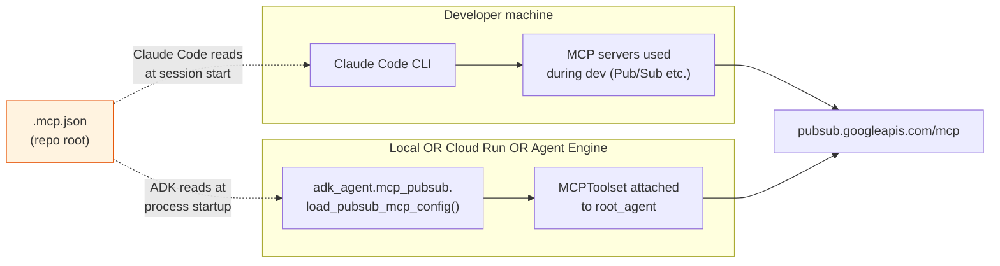
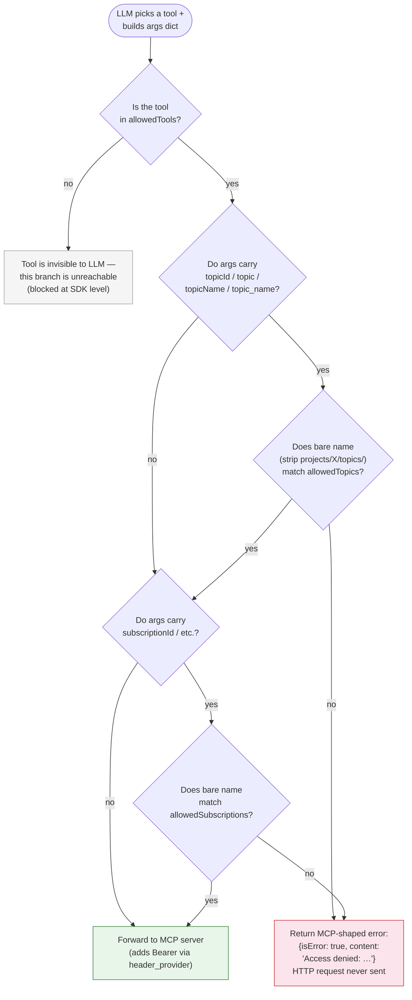

# MCP (Model Context Protocol)

This project uses MCP — the [Model Context Protocol](https://modelcontextprotocol.io/) —
to give the ADK agent access to **Google Cloud Pub/Sub** as if it were a
first-class tool, without writing any Python code that talks to the
Pub/Sub API directly. The Pub/Sub MCP server is **the only MCP server
wired in by default**, but the same machinery scales to additional
servers by appending entries to `.mcp.json`.

This guide covers what MCP is in the context of this project, the
deny-by-default allowlist semantics, how `.mcp.json` is consumed in each
deployment mode, IAM requirements, and how to add a new MCP server.

## Two-tier MCP usage

`.mcp.json` is consumed by **two independent runtimes**:

| Runtime | Reads `.mcp.json` for | When |
|---|---|---|
| Claude Code (the dev CLI) | Project-scoped MCP servers used during local development of this repo. | When the developer opens this directory in Claude Code and approves the project-scoped MCP prompt. |
| ADK agent (`adk_agent/mcp_pubsub.py`) | Runtime tools attached to the deployed `LlmAgent` so end-user chat turns can publish/list/etc. | At process startup, every time the agent is constructed — locally, in Mode A Cloud Run, and in Mode B Agent Engine. |

The two consumers share the **same file** and the **same allowlists**.
A change to `.mcp.json` affects both — that is the design intent. The
ADK agent never reaches into Claude Code's MCP plumbing and Claude Code
never reaches into the ADK agent's; they each independently parse the
file.



## What `.mcp.json` looks like

The file at the repo root:

```json
{
  "mcpServers": {
    "pubsub": {
      "type": "http",
      "url": "https://pubsub.googleapis.com/mcp",
      "headers": {
        "x-goog-user-project": "sap-advanced-workshop-gck"
      },
      "allowedTools": [
        "list_topics",
        "get_topic",
        "list_subscriptions",
        "get_subscription",
        "publish"
      ],
      "allowedTopics": ["sapphire-demo"],
      "allowedSubscriptions": ["sapphire-demo-sub"]
    }
  }
}
```

| Field | Required | Purpose |
|---|---|---|
| `mcpServers.<name>.type` | yes | Must be `"http"` (HTTP MCP transport). |
| `mcpServers.<name>.url` | yes | MCP server endpoint. The default is Google Cloud's public Pub/Sub MCP at `https://pubsub.googleapis.com/mcp`. |
| `mcpServers.<name>.headers` | yes | Static headers added to every MCP request. **Must include `x-goog-user-project`** — this is the GCP project billed for the API calls and the ID Pub/Sub uses to scope topics/subscriptions. |
| `mcpServers.<name>.allowedTools` | yes (deny-by-default) | Whitelist of MCP tool names the LLM is allowed to call. **If absent or empty, zero tools are exposed.** |
| `mcpServers.<name>.allowedTopics` | yes (deny-by-default) | Whitelist of bare topic names. Calls whose args carry a `topicId`/`topic`/`topicName`/`topic_name` outside this list are rejected before the HTTP call leaves the agent. |
| `mcpServers.<name>.allowedSubscriptions` | yes (deny-by-default) | Same shape as `allowedTopics`, but for subscriptions. |

**Bearer tokens are never put in `.mcp.json`.** The file is checked
into git. Authentication uses **Application Default Credentials (ADC)**
fetched at runtime — `gcloud auth application-default login` for local
dev, or the runtime service account in Cloud Run / Agent Engine. The
ADK toolset's `header_provider` re-fetches the token per HTTP exchange,
so token refresh is transparent (`adk_agent/mcp_pubsub.py:154-176`).

## Deny-by-default semantics

Three independent allowlists, all enforced at agent construction +
call time:

| Allowlist | Enforcement layer | What happens on violation |
|---|---|---|
| `allowedTools` | ADK `McpToolset(tool_filter=…)` — SDK level | The disallowed tool is **never advertised to the LLM**. The model cannot select it. |
| `allowedTopics` | `before_tool_callback` (`adk_agent/mcp_pubsub.py:make_pubsub_resource_gate`) — call-time arg inspection | The call is short-circuited with `{"isError": true, "content":[{"type":"text","text":"Access denied: …"}]}`. The MCP server is never reached. |
| `allowedSubscriptions` | Same as `allowedTopics` | Same. |

Tool-name filtering and resource filtering are deliberately **two
separate gates** because the upstream Pub/Sub MCP server doesn't have a
notion of project-scoped allowlists — the `tool_filter` only restricts
which tools the model can pick, not which topics/subscriptions it can
operate on. The resource gate fixes that.

The arg-key inspector is liberal: it strips full resource paths
(`projects/X/topics/Y` → `Y`) and accepts the four common naming
variants (`topicId`, `topic`, `topicName`, `topic_name`). See
`_extract_bare_name` in `adk_agent/mcp_pubsub.py`. If you add a new
MCP server with a different arg shape, write a corresponding gate.

### Gate decision flow

Every tool call the LLM picks goes through this evaluation **before**
any HTTP request leaves the agent process:



A gate violation never leaves the agent process and never costs an
HTTP round-trip. The model sees a structured error and can self-correct
on the next turn — typical recovery is to retry with a topic name from
the allowlist surfaced in its system prompt (the `instruction_block`
emitted by `setup_pubsub_mcp()` enumerates allowed resources).

## End-to-end Pub/Sub call flow

Sequence of events when the user asks "publish a hello message to
`sapphire-demo`" and the LLM picks the `publish` tool:

```mermaid
sequenceDiagram
  autonumber
  participant U as User
  participant LLM as LlmAgent (root_agent)
  participant Gate as before_tool_callback<br/>(deny gate)
  participant HP as header_provider
  participant ADC as Application Default<br/>Credentials
  participant MCP as pubsub.googleapis.com/mcp
  participant PubSub as Pub/Sub API

  U->>LLM: "publish hello to sapphire-demo"
  LLM->>LLM: Pick tool=publish<br/>args={topic: "sapphire-demo", data: "aGVsbG8="}
  LLM->>Gate: tool, args, tool_context
  Gate->>Gate: _extract_bare_name(args.topic) → "sapphire-demo"<br/>in allowedTopics? ✓
  Gate-->>LLM: pass-through (None)
  LLM->>HP: build headers for HTTP exchange
  HP->>ADC: credentials.refresh(AuthRequest()) if !valid
  ADC-->>HP: token
  HP-->>LLM: {x-goog-user-project: …, Authorization: "Bearer …"}
  LLM->>MCP: POST /mcp { method: tools/call, params: {name: publish, arguments: …} }
  MCP->>PubSub: pubsub.projects.topics.publish (caller=ADC principal)
  PubSub-->>MCP: { messageIds: ["..."] }
  MCP-->>LLM: { content: [{type: "text", text: "..."}] }
  LLM-->>U: "Published; messageId=..."
```

Key properties this diagram makes visible:

- **Gate runs first** (steps 3–5). A blocked call never advances past
  step 5; no token is fetched and no HTTPS request is made.
- **Token freshness is per-exchange** (steps 6–8). The `header_provider`
  is invoked for every MCP call, so a stale ADC token is refreshed
  transparently — the toolset itself is never rebuilt.
- **The MCP server is the IAM enforcement point** (step 10). Even if
  the gate were bypassed, the upstream Pub/Sub API still validates the
  bearer token against the principal's roles. The gate is defense in
  depth, not the only barrier.

## How `.mcp.json` is delivered to the runtime

The ADK agent resolves the file via
`adk_agent/mcp_pubsub.py:_default_mcp_config_path()`:

1. `MCP_CONFIG_PATH` env var (highest priority).
2. `<package root>/.mcp.json` — derived from the location of the
   `adk_agent/` package, not `cwd()`. This is what works in Cloud Run.
3. `Path.cwd() / ".mcp.json"` — legacy fallback for `uv run` from the
   repo root.

This means **each deployment mode delivers the file differently**:

### Local dev (`uv run python -m adk_agent.server`)

The file is at `./.mcp.json` and the package is at `./adk_agent/`. Path
resolution picks step 2 (or step 3 — both point at the same file).
Nothing to configure.

### Mode A — Cloud Run × 2

`adk_agent/Dockerfile` includes:

```dockerfile
COPY .mcp.jso[n] ./
```

The trailing `[n]` glob matches `.mcp.json` if it exists and silently
no-ops otherwise — so the build stays green for forks that don't ship
the file. Path resolution picks step 2 at runtime
(`/app/.mcp.json` — sibling of `/app/adk_agent/`).

`deploy/deploy-cloud-run.sh` also detects the file and adds
`roles/mcp.toolUser` + `roles/pubsub.editor` to the runtime SA when
present.

### Mode B — Vertex AI Agent Engine

`deploy/deploy-agent-engine.py` bundles the file via
`extra_packages=["./adk_agent", "./.mcp.json"]` and sets
`MCP_CONFIG_PATH=/app/.mcp.json` in the deployed env. Path resolution
picks step 1 at runtime, hitting the file Agent Engine extracted from
the bundle.

### Disabling Pub/Sub MCP

To run **without** Pub/Sub support: delete or rename `.mcp.json`. The
agent logs `mcp.pubsub.not_configured` once at startup and exposes only
the 5 base tools (RAG + 4 SAP) instead of 6. Nothing else changes.

## IAM requirements

The principal that ultimately calls `pubsub.googleapis.com/mcp` needs
**both** roles:

| Role | Why |
|---|---|
| `roles/mcp.toolUser` | Gates the `mcp.tools.call` permission. Without this, the MCP endpoint returns 403 even though the API call shape is valid. |
| `roles/pubsub.editor` (or finer-grained `pubsub.publisher`/`pubsub.subscriber`) | The actual Pub/Sub data-plane permission. The MCP server forwards to the Pub/Sub API on the caller's behalf. |

| Environment | Principal |
|---|---|
| Local dev | The Google account from `gcloud auth application-default login`. |
| Mode A — Cloud Run | The service account `sap-rag-runner` (created and bound by `deploy/deploy-cloud-run.sh` when `.mcp.json` is present). |
| Mode B — Agent Engine | The service account `agent-engine-sa` (granted the same roles by `deploy/setup-agent-engine.sh` when `.mcp.json` is present). |

`x-goog-user-project` in `.mcp.json` must point at a project where
**Pub/Sub API is enabled** and the calling principal is recognized:

```bash
gcloud services enable pubsub.googleapis.com --project sap-advanced-workshop-gck
```

## Verifying the wiring

Three tests cover the path:

```bash
# Unit — config parsing + deny-by-default semantics
uv run python -m pytest \
  adk_agent/tests/unit/test_mcp_pubsub_config.py \
  adk_agent/tests/unit/test_mcp_pubsub_gate.py -v --no-cov

# Integration — root_agent imports with the right tool count
uv run python -m pytest adk_agent/tests/unit/test_agent_smoke.py -v --no-cov
# Asserts len(root_agent.tools) is 5 (no Pub/Sub) or 6 (with Pub/Sub)

# Live — actually publish a message via the MCP toolset
uv run python scripts/test_pubsub_mcp_live.py
# Requires the sapphire-demo topic + subscription to exist in
# x-goog-user-project. Confirms upload via the MCP path; arrival is
# verified out-of-band with: gcloud pubsub subscriptions pull sapphire-demo-sub
```

## Usage examples

How a chat session looks once the MCP toolset is attached. The agent's
system prompt includes the `instruction_block` from
`setup_pubsub_mcp()` listing allowed tools/topics/subscriptions, so the
LLM picks valid arguments without needing the user to spell them out.

### Example 1 — list topics (allowed)

```
User:  what Pub/Sub topics do we have?
Agent: [tool_call] list_topics(projectId="sap-advanced-workshop-gck")
       [tool_response] {"topics": [{"name": "projects/.../topics/sapphire-demo"}]}
       You have one topic: sapphire-demo.
```

`list_topics` doesn't carry a `topicId` arg, so the deny-gate
short-circuits at the first decision (no resource arg → forward
through). The tool itself is in `allowedTools`.

### Example 2 — publish to an allowed topic

```
User:  publish "hello world" to sapphire-demo
Agent: [tool_call] publish(topic="sapphire-demo", data="aGVsbG8gd29ybGQ=")
       [tool_response] {"messageIds": ["13029384720394823"]}
       Published. Message ID: 13029384720394823.
```

Note the LLM base64-encoded the payload — this is documented in the
`instruction_block` so the model gets the convention right on the
first try without a tool error.

### Example 3 — publish to a blocked topic (deny gate hit)

```
User:  publish "test" to other-topic
Agent: [tool_call] publish(topic="other-topic", data="dGVzdA==")
       [tool_response] {"isError": true,
                        "content": [{"type": "text",
                                     "text": "Access denied: 'other-topic'
                                              is not in allowedTopics"}]}
       I can't publish to other-topic — the agent's allowlist only
       includes: sapphire-demo. Want me to try that instead?
```

The MCP server was never contacted. The structured error gives the
LLM enough context to recover gracefully (suggest the allowed value)
instead of looping on the same blocked call.

### Example 4 — deleting `.mcp.json` (Pub/Sub disabled)

```
User:  list our Pub/Sub topics
Agent: I don't have Pub/Sub tools available in this deployment.
       (At startup the agent logs `mcp.pubsub.not_configured`.)
```

With `.mcp.json` absent, the LLM never sees `list_topics` /
`publish` / etc. in its tool surface, so it falls back to a plain-text
"can't do that" response.

## Troubleshooting

| Symptom | Likely cause | Fix |
|---|---|---|
| Agent starts but logs `mcp.pubsub.not_configured` | `.mcp.json` not found at any of the 3 resolution paths. | Verify `MCP_CONFIG_PATH` env (Mode B) or that the file is COPYed into the image (Mode A). For local dev, run from the repo root or set `MCP_CONFIG_PATH=$PWD/.mcp.json`. |
| Agent starts but logs `mcp.pubsub.config_read_failed` | `.mcp.json` exists but JSON is malformed, or `mcpServers.pubsub` block is missing required keys (`type`, `url`, `headers.x-goog-user-project`). | Validate with `python -c "import json; json.load(open('.mcp.json'))"`; cross-check against the schema table above. |
| Agent starts but logs `mcp.pubsub.adc_unavailable` | `google.auth.default()` couldn't find credentials. | Local dev: `gcloud auth application-default login`. Cloud Run / Agent Engine: check the runtime SA exists and is attached to the service. |
| MCP returns HTTP 403 `permission denied on mcp.tools.call` | Caller is missing `roles/mcp.toolUser`. | Grant on the project: `gcloud projects add-iam-policy-binding $PROJECT_ID --member=… --role=roles/mcp.toolUser`. |
| MCP returns HTTP 403 `permission denied on pubsub.topics.…` | Caller is missing the data-plane Pub/Sub role. | Grant `roles/pubsub.editor` (or finer-grained). |
| MCP returns HTTP 401 / token refresh loop | ADC token is being refused — typically because `x-goog-user-project` points at a project the caller can't access, or Pub/Sub API isn't enabled there. | `gcloud services enable pubsub.googleapis.com --project <x-goog-user-project>` and `gcloud projects describe <x-goog-user-project>` to confirm access. |
| Tool call returns `{"isError": true, "text": "Access denied: '…' is not in allowedTopics"}` | The deny-gate matched. | Either add the value to `allowedTopics` in `.mcp.json` and redeploy, or instruct the user to use an allowed topic. The error text always names the offending value. |
| `len(root_agent.tools) == 5` instead of 6 in tests | Pub/Sub MCP didn't load — same root cause as the first three rows above. The `test_agent_smoke.py` assertion accepts either count, but you can investigate by running with `LOG_LEVEL=debug` and grepping for `mcp.pubsub`. | See the first three rows. |
| Agent Engine deploy succeeds but tool calls fail with TLS / DNS errors | VPC-SC is enabled on the project; Agent Engine in private mode loses default internet egress, so `pubsub.googleapis.com` is unreachable. | Either disable VPC-SC for the project, or stand up a proxy VM in your VPC with Cloud NAT and route MCP traffic through it (see Caveats below). |
| Live test `scripts/test_pubsub_mcp_live.py` hangs at "publishing" | The MCP server accepted the request but the topic doesn't exist. | `gcloud pubsub topics create sapphire-demo --project <x-goog-user-project>` and `gcloud pubsub subscriptions create sapphire-demo-sub --topic sapphire-demo`. |

Diagnostic one-liners:

```bash
# Confirm ADC is set up and resolves to the expected principal
gcloud auth application-default print-access-token >/dev/null && echo OK

# Confirm Pub/Sub API is enabled in the project that x-goog-user-project names
gcloud services list --enabled --filter="name:pubsub.googleapis.com" \
  --project $(jq -r '.mcpServers.pubsub.headers["x-goog-user-project"]' .mcp.json)

# Confirm both required roles are bound to the caller
PRINCIPAL="user:$(gcloud config get account)"   # or serviceAccount:…
gcloud projects get-iam-policy $PROJECT_ID \
  --flatten=bindings --filter="bindings.members:$PRINCIPAL" \
  --format="value(bindings.role)" | grep -E "mcp\.toolUser|pubsub"
```

## Adding a new MCP server

The current `adk_agent/mcp_pubsub.py` is **Pub/Sub-specific** — it
knows the Pub/Sub arg shape (`topicId`, `subscriptionId`, …) and
imposes a Pub/Sub-flavored deny-by-default gate. If you add a second
MCP server (say, BigQuery), the ergonomic move is to write a sibling
`adk_agent/mcp_<service>.py` with its own gate and call both
`setup_<service>_mcp()` functions in `adk_agent/agent.py`.

Concrete steps:

1. **Add the entry to `.mcp.json`** under `mcpServers.<name>` with the
   same shape: `type: "http"`, `url`, `headers` (with
   `x-goog-user-project`), and any service-specific allowlists you
   want enforced.
2. **Create `adk_agent/mcp_<name>.py`** modeled on `mcp_pubsub.py`:
   `load_<name>_mcp_config`, `build_<name>_toolset`,
   `make_<name>_resource_gate`, `setup_<name>_mcp` returning a
   bundle. The gate must reject **before** the HTTP call leaves the
   agent — that's the only place the GCP-side IAM can't second-guess.
3. **Wire it into `adk_agent/agent.py`** alongside the existing
   `setup_pubsub_mcp()` call. Each bundle contributes its own toolset,
   instruction block, and `before_tool_callback`. To keep multiple
   gates composable, chain them in a single
   `before_tool_callback=lambda …: pubsub_gate(…) or bigquery_gate(…)`.
4. **Grant IAM on the runtime SA**: `roles/mcp.toolUser` is
   server-agnostic but each MCP needs its own data-plane role — e.g.
   `roles/bigquery.dataEditor` for BigQuery MCP. Update
   `deploy/deploy-cloud-run.sh` and `deploy/setup-agent-engine.sh`
   accordingly.
5. **Add tests** parallel to `test_mcp_pubsub_config.py` /
   `test_mcp_pubsub_gate.py`. The smoke test in `test_agent_smoke.py`
   may need its tool-count assertion updated.

## Caveats

- **`.mcp.json` is checked into git.** Don't put bearer tokens, API
  keys, or per-environment URLs in it. Use it for **non-secret routing
  + allowlists only**; rely on ADC / runtime SAs for credentials.
- **Pub/Sub MCP requires HTTPS to the public internet.** Cloud Run's
  default egress works. Agent Engine's PSC-interface mode in Mode B
  retains default internet egress as long as VPC-SC is **not** enabled
  on the project (see [Agent Engine networking docs](https://cloud.google.com/vertex-ai/generative-ai/docs/agent-engine/private-service-connect-interface)).
  If you turn on VPC-SC, you'll need a proxy VM in your VPC to reach
  `pubsub.googleapis.com`.
- **The deny-by-default arg gate only catches Pub/Sub-shaped calls.**
  Any new MCP server needs its own gate; copying `mcp_pubsub.py` is
  the path of least resistance.

## File reference

| Path | Role |
|---|---|
| `.mcp.json` | Single source of truth for MCP routing + allowlists. |
| `adk_agent/mcp_pubsub.py` | Config loader, toolset builder, deny-by-default `before_tool_callback`. |
| `adk_agent/agent.py` | Calls `setup_pubsub_mcp()` and attaches the bundle to `root_agent`. |
| `adk_agent/Dockerfile` | `COPY .mcp.jso[n] ./` — Mode A delivery. |
| `deploy/deploy-agent-engine.py` | `extra_packages=[…, "./.mcp.json"]` + `MCP_CONFIG_PATH` env — Mode B delivery. |
| `deploy/deploy-cloud-run.sh` | Grants `roles/mcp.toolUser` + `roles/pubsub.editor` when `.mcp.json` is present. |
| `deploy/setup-agent-engine.sh` | Same role grants for Mode B. |
| `scripts/test_pubsub_mcp_live.py` | Live smoke test against the upstream MCP. |
| `CLAUDE.md` (Runtime Pub/Sub MCP section) | Notes on Cloud Run runtime expectations. |

## See also

- [ARCHITECTURE.md §9 Pub/Sub MCP toolset](./ARCHITECTURE.md#9-pub-sub-mcp-toolset)
  — internals of the resource gate and toolset construction.
- [DEPLOYMENT.md §5 Pub/Sub MCP](./DEPLOYMENT.md#5-pub-sub-mcp-optional)
  — operations / IAM checklist.
- [`deploy/README.md`](../../deploy/README.md) — per-mode deploy
  walkthroughs that integrate MCP wiring.
- Upstream: [Google Cloud Pub/Sub MCP](https://docs.cloud.google.com/pubsub/docs/use-pubsub-mcp).
