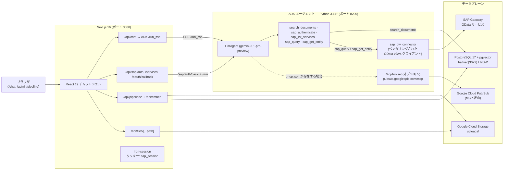
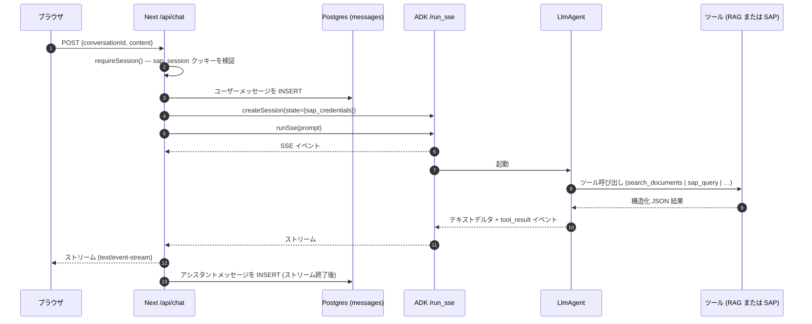
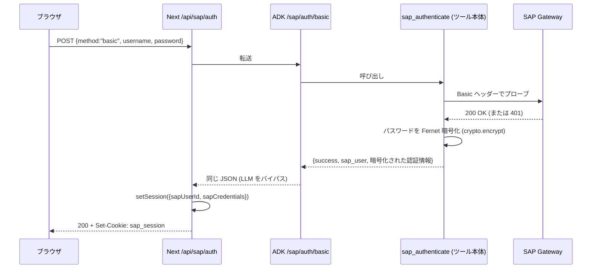
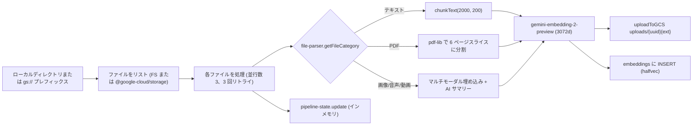
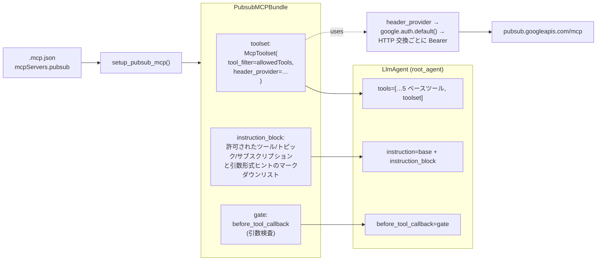
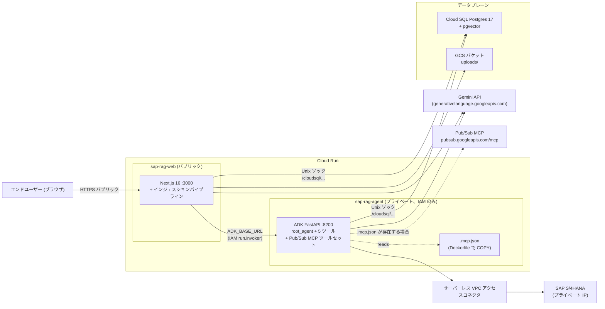
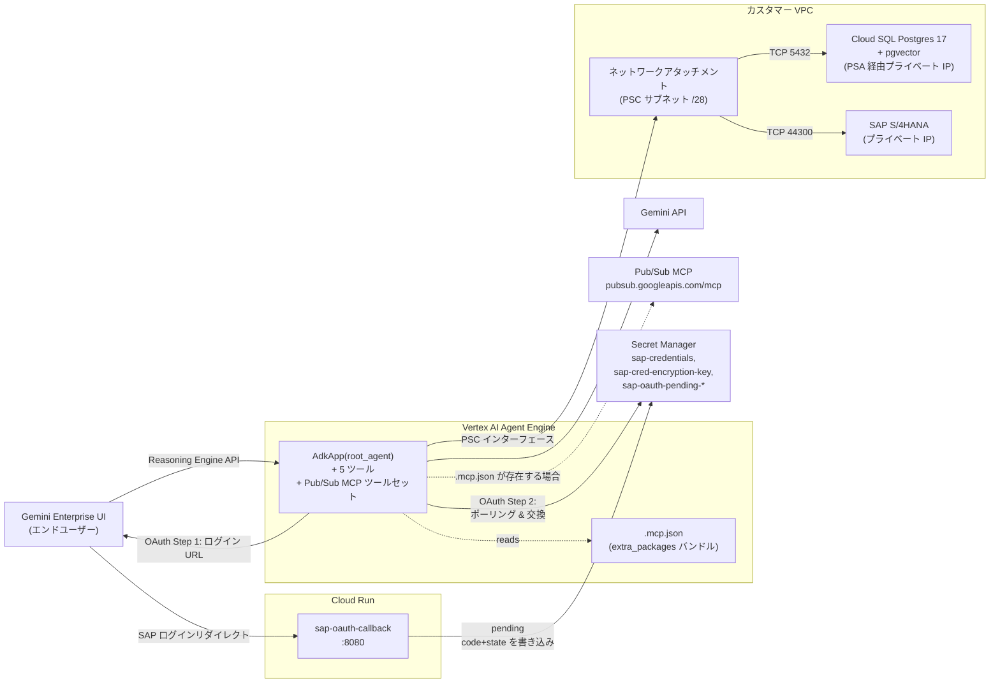

# アーキテクチャ

## 1. ランタイムトポロジー

2 つの長期プロセスと PostgreSQL および Google Cloud Storage で構成されます。Next.js アプリは**エージェントロジックを持ちません** — すべてのチャットターンは SSE を通じて ADK エージェントへプロキシされます。



**スタンドアロンの SAP サイドカーなし。** 以前の `sap-service/` FastAPI プロセス（ポート 8100）は削除されました。SAP Gateway への呼び出しは現在、ベンダリングされた `adk_agent/sap_gw_connector` パッケージを通じて ADK エージェント内でインプロセスで行われます。

## 2. 技術スタック層

| 層 | 技術 |
|-------|------------|
| チャット UI | Next.js 16（App Router、Turbopack）、React 19、Tailwind 4、shadcn/ui |
| ストリーミング + インジェスション API | Next.js Route Handlers（`runtime='nodejs'`、`maxDuration` 最大 300 秒） |
| エージェント | Google ADK Python（`google-adk>=1.27`）、5 ツール付き `LlmAgent`、オプションの MCP ツールセット |
| エージェントトランスポート | `google.adk.cli.fast_api.get_fast_api_app` でビルドされた FastAPI、`/run_sse` 上の SSE |
| LLM | `gemini-3.1-pro-preview`（`SAP_AGENT_MODEL` で上書き可） |
| 埋め込み | `gemini-embedding-2-preview`（Next.js インジェスション）と `gemini-embedding-001`（ADK クエリパス）。どちらも 3072 次元ベクトルを生成 |
| ベクトルストア | PostgreSQL 17 + `pgvector`（`halfvec(3072)` と HNSW インデックス） |
| ファイルストレージ | Google Cloud Storage。`/api/files/...` 経由でトラバーサルガード付きで配信 |
| 認証（Web） | iron-session クッキー `sap_session`（8 時間）; 別途 `sap_oauth_pending` クッキー（10 分） |
| 認証（SAP） | Basic および OAuth 2.0 + PKCE; SAP 認証情報は `SAP_CRED_ENCRYPTION_KEY` 経由で Fernet 暗号化し、ADK セッション状態に保存 |
| オプション MCP | Google Cloud Pub/Sub HTTP MCP、デフォルト拒否許可リスト |
| ロギング | `pino`（Next）+ `structlog`（ADK）、JSON をファイルへ + オプションのきれいな stdout |

## 3. データフロー: チャットターン（RAG および/または SAP）



Next.js レイヤーの動作:
- SSE チャンクを解析し（`src/lib/adk-client.ts`）、Gemini `parts[]` をフラットな `{type: text_delta | tool_call | tool_result | error}` イベントストリームに正規化し、コンテンツの重複を避けるため `partial:false` 集計テキストフレームを**ドロップ**します。
- ADK 呼び出し前にユーザーメッセージを永続化し、ストリーム終了後にアシスタントメッセージを永続化します。最初のターンで会話に自動的にタイトルを付けます。
- トランザクション全体を `sap_session` クッキーから取得した `sap_user_id` にスコープします（`src/lib/session.ts` 参照）。

## 4. データフロー: SAP 認証

### 4.1 Basic 認証



Next.js に返される認証情報ブロブには Fernet 暗号化されたパスワードが含まれており、平文のパスワードは含まれません。後続のチャットターンでは ADK セッション状態に戻されるため、`sap_query`/`sap_get_entity` は `_client_for` 内で呼び出し時に復号できます（`adk_agent/tools/query_tool.py` 参照）。

### 4.2 OAuth 2.0 + PKCE

```mermaid
sequenceDiagram
  participant U as ブラウザ
  participant L as LlmAgent
  participant Auth as sap_authenticate
  participant SAP as SAP /oauth
  participant N as Next /api/sap/oauth/callback

  Note over U,L: チャット中に LLM が SAP が必要と判断<br/>かつ認証情報がない
  L->>Auth: sap_authenticate(method="oauth", user_id)
  Auth-->>L: {success:false, action_required:"sap_login", login_url, oauth_state}
  L-->>U: login_url をそのまま提示（システムプロンプトに従い）
  U->>SAP: login_url を開いて認証
  SAP-->>U: /api/sap/oauth/callback?code&state にリダイレクト
  U->>N: GET callback
  N->>N: sap_oauth_pending クッキーに対して state を検証
  Note over N: Step-2 トークン交換の配線は現在 TODO;<br/>callback は失敗クローズ。
```

コールバックページ（`src/app/api/sap/oauth/callback/route.ts`）は現在**失敗クローズ** — 親ウィンドウに失敗メッセージをポストするポップアップ HTML を返します。ADK の Step-2 エンドポイント（`adk_agent/oauth.exchange_code`）への配線は [`docs/followups/post-migration.md`](../followups/post-migration.md) でトラッキングされているオープンなフォローアップです。

## 5. データフロー: インジェスションパイプライン



エントリポイントは `src/lib/embedding-ingest.ts` です。後続処理はすべて Next.js プロセス内で実行されます。ADK エージェントの RAG ツールは同じ `embeddings` テーブルからのみ読み取り — 書き込みは行いません。

## 6. データベーススキーマ

| テーブル | 主要カラム | 備考 |
|-------|-------------|-------|
| `embeddings` | `id`、`file_name`、`file_type`、`file_path`、`chunk_index`、`chunk_text`、`content_summary`、`embedding vector(3072)`、`metadata jsonb` | コサイン検索用 HNSW halfvec インデックス; ファイル名認識ルックアップ用 `file_name` インデックス |
| `conversations` | `id`、`sap_user_id varchar(255)`、`title`、タイムスタンプ | `(sap_user_id, updated_at desc)` の複合インデックス — すべてのリスト/削除操作は SAP ユーザーごとにスコープ |
| `messages` | `id`、`conversation_id`（FK CASCADE）、`role`、`content`、`file_name`、`attachments jsonb`、`created_at` | `(conversation_id, created_at)` インデックス |

3 つのテーブルはすべて `pnpm db:setup` で作成されます。`conversations` に `sap_user_id` カラムがないレガシー DB の場合は `pnpm db:migrate:sap-user-id` を実行してください。

## 7. コンポーネント階層（Next.js）

```
src/app/
├── layout.tsx                      # ルート html + フォント配線
├── page.tsx                        # redirect('/chat')
├── chat/page.tsx                   # シェル: <ChatSidebar/> + <ChatWindow/> + <ChatInput/>
└── admin/pipeline/page.tsx         # <PipelineDashboard/>

src/components/
├── ChatSidebar.tsx                 # 会話リスト、新規/選択/削除、ログアウト
├── ChatWindow.tsx                  # マークダウンストリーム、コピーボタン、添付ファイルグリッド、インライン SAP ログインフォーム
├── ChatInput.tsx                   # テキストエリア + ペーパークリップ
├── SAPDataView.tsx                 # 汎用レコード配列 → テーブルレンダラー（チャット結果で使用）
├── PipelineDashboard.tsx           # ソースパス入力 + フォルダアップロード + ステータスポーリング
└── ui/                             # shadcn プリミティブ
```

## 8. ADK エージェント内部

```
adk_agent/
├── agent.py            # LlmAgent (モデル、システムプロンプト、ツール登録順序、before_tool_callback)
├── server.py           # build_app() → FastAPI + /healthz + /sap/auth/basic
├── settings.py         # フローズンデータクラス; REQUIRED = [DATABASE_URL, SAP_HOST, EMBED_MODEL, EMBED_OUTPUT_DIM, SAP_CRED_ENCRYPTION_KEY]
├── probes.py           # 4 つの起動プローブ（yaml、db、埋め込みモデル、Secret Manager）
├── mcp_pubsub.py       # Pub/Sub MCP ツールセット + デフォルト拒否 before_tool_callback
├── oauth.py            # build_login_url、exchange_code（PKCE）
├── crypto.py           # Fernet シングルトン: encrypt()、decrypt()
├── services.yaml       # SAP カタログ: 4 つの OData サービス + エンティティ + キーフィールド
├── rag/
│   ├── db.py           # asyncpg プール; SELECT … 1 - (embedding <=> $1::vector) AS score …
│   └── embedding.py    # genai.aio.models.embed_content (RETRIEVAL_QUERY タスクタイプ)
└── tools/              # 5 つの callable; tool_context.state は Next.js によりターンごとに設定
```

### ツール登録順序（`agent.py`）

1. `search_documents`
2. `sap_authenticate`
3. `sap_list_services`
4. `sap_query`
5. `sap_get_entity`
6. *（オプション）* `McpToolset(pubsub …)` — `setup_pubsub_mcp()` がバンドルを返す場合

システムプロンプトは LLM に以下を明示的に指示します:
- ドキュメントに関する質問は `search_documents` に、SAP に関する質問は `sap_query` にルーティングする。
- `action_required` エンベロープをそのまま提示する（`login_url` がある場合はユーザーに提示する）。
- SAP の結果をマークダウンテーブルとしてレンダリングし、RAG の `source` フィールドを引用する。

### ツールの認証ゲート

`sap_query` と `sap_get_entity` は `tool_context.state["sap_credentials"]` がない場合に短絡します:

```json
{ "success": false, "action_required": "sap_login", "error": "not_authenticated" }
```

`SAPAuthenticationError`（例: トークン期限切れ）の場合、エンベロープは `action_required: "re_authenticate"` になり、フロントエンドはユーザーに再ログインを促します。その他の失敗は構造化エラーエンベロープを返します（[API.md](./API.md#sap_query) 参照）。

## 9. Pub/Sub MCP ツールセット

`.mcp.json` が有効な `mcpServers.pubsub` HTTP エントリを定義している場合、`adk_agent/mcp_pubsub.py:setup_pubsub_mcp()` は `LlmAgent` の異なるスロットに配線される 3 つのアーティファクトを持つ `PubsubMCPBundle` を生成します:



- `toolset` — `McpToolset(StreamableHTTPConnectionParams, tool_filter=allowed_tools, header_provider=…)`。`header_provider` は HTTP 交換ごとに `https://www.googleapis.com/auth/pubsub` の ADC トークンをリクエストするため、トークンのリフレッシュはツールセットを再ビルドすることなく透過的に行われます。
- `instruction_block` — 許可されたツール、トピック、サブスクリプションと引数形式ヒント（ベアな `projectId` 文字列、`publish` の `data` の base64 エンコード）を列挙するマークダウンシステムプロンプトセクション。エージェントのインストラクションに連結されます。これがないと、LLM はツールエラーを通じて規約を発見しなければなりませんが、あれば通常最初の試行で有効な引数を選択できます。
- `gate` — `before_tool_callback`。ツール引数で `topicId / topic / topicName / topic_name`（およびサブスクリプションバリアント）のいずれかを検査し、`_extract_bare_name` 経由で `projects/X/topics/` と `topics/` プレフィックスを除去し、一致しない値を `{"isError": true, "content":[{"type":"text","text":"Access denied: …"}]}` で拒否します。詳細な評価順序については [MCP.md の「ゲート決定フロー」](./MCP.md#gate-decision-flow) を参照してください。

**デフォルト拒否ポリシー**:

| `.mcp.json` フィールド | 欠如/空の場合の効果 |
|-------------------|--------------------------|
| `allowedTools` | 0 個の Pub/Sub ツールが LLM に公開される |
| `allowedTopics` | `topicId` 引数を含むすべての呼び出しが拒否される |
| `allowedSubscriptions` | `subscriptionId` 引数を含むすべての呼び出しが拒否される |

呼び出し元プリンシパルは `roles/mcp.toolUser`（`mcp.tools.call` 権限をゲート）と `roles/pubsub.editor`（またはより細粒度の Pub/Sub ロール）の両方を持つ必要があります。ローカル開発では `gcloud auth application-default login` を 1 回実行するだけで十分です。Cloud Run の場合は、ランタイムサービスアカウントにロールを付与してください。

## 10. ロギングとリクエストコンテキスト

| プロセス | ロガー | ファイル |
|---------|--------|------|
| Next.js | pino、オプションの `pino-pretty` stdout | `${LOG_DIR ?? './logs'}/{service}.log` |
| ADK エージェント | `structlog` JSON | stdout（Cloud Run / Docker が収集） |

どちらも `LOG_LEVEL`（`debug | info | warn | error`）と `LOG_PAYLOAD`（`meta | full` — SAP レスポンスボディのキャプチャ量を制御）を尊重します。

`src/lib/request-context.ts` は `AsyncLocalStorage` を使用して、単一のチャットターン中に発行されるすべてのログ行に `{requestId, conversationId}` を付加します。機密フィールド（`Authorization`、`Set-Cookie`、`Cookie`、`access_token`、`refresh_token`、`password`）は `src/lib/logger.ts` の pino 設定によってリダクトされます。

## 11. セキュリティアーキテクチャ

- **セッション署名。** `iron-session` は `SAP_SESSION_SECRET`（≥ 32 文字）で `sap_session` および `sap_oauth_pending` クッキーに署名します。`httpOnly`、`sameSite=lax`、本番環境のみ `secure`。
- **保存時の SAP 認証情報。** Basic 認証パスワードは ADK プロセスを離れる前に `SAP_CRED_ENCRYPTION_KEY` で Fernet 暗号化されます。iron-session クッキーが暗号化ブロブを保持し、ADK ツールは OData 呼び出し時に復号します。
- **GCS プロキシ。** `src/lib/gcs.ts:downloadFromGCS` は `uploads/` プレフィックスを強制し、`..` を含むパスを拒否します。`/api/files` ルートは `Cache-Control: public, max-age=86400` で配信します。
- **CSP とヘッダー。** `next.config.ts` は厳格な CSP、`X-Frame-Options DENY`、`nosniff`、HSTS スタイルのオプションを提供します。
- **認証ゲート。** `.env.local` で `REQUIRE_AUTH=true` を設定すると、`src/proxy.ts`（Next 16 の名称変更されたミドルウェア）が各ハンドラーの `requireSession()` に加えてプロキシ層で保護されたルートをゲートします。ユーザーがログインできるよう `/api/sap/auth` は意図的に除外されています。
- **Pub/Sub 許可リスト。** デフォルト拒否ゲート（§9 参照）は、アップストリーム MCP がより多くを公開していても、LLM がキュレートされたセット外のトピック/サブスクリプションに触れることを防ぎます。

## 12. 運用上の注意

- 両プロセスは、`pipeline-state.ts`（インメモリのインジェスション進捗、再起動時に消失）とインメモリの ADK セッションバックエンド（`ADK_SESSION_BACKEND=memory` デフォルト）を除いてステートレスです。本番環境では ADK を `vertex` に切り替えて、セッションがレプリカ間で永続化されるようにしてください。
- `db.ts`、`logger.ts`、`gemini.ts`、`gcs.ts` の HMR 対応シングルトンは**まだ適用されていません** — 長い開発セッションでは Postgres プールとログストリームが蓄積されます。CLAUDE.md でトラッキングされています。
- Predev ガード `scripts/check-parent-workspace.mjs` は、親ディレクトリにワークスペースマーカー（`package.json`、`*-lock.*`、`pnpm-workspace.yaml`）が見つかった場合に `next dev` の起動を拒否します。詳細は CLAUDE.md の Turbopack CSS リゾルバーバグの説明と [`docs/issues/2026-04-29-nextjs-turbopack-css-resolver-bug.md`](../issues/2026-04-29-nextjs-turbopack-css-resolver-bug.md) のアップストリームドラフトを参照してください。

デプロイの詳細については [DEPLOYMENT.md](./DEPLOYMENT.md) を参照してください。完全なエンドポイントペイロードについては [API.md](./API.md) を参照してください。

## 13. デプロイトポロジー

§1 のランタイムトポロジーは**ローカル開発**のレイアウトを示しています。2 つの本番トポロジーが `deploy/` にスクリプト化されています。両方とも 1 つの Cloud SQL Postgres + pgvector インスタンスを共有しますが、`.mcp.json` と MCP ツールセットがランタイムに配送される方法はモードによって異なります。

デプロイスクリプトとステップバイステップの手順については [`deploy/README.md`](../../deploy/README.md) を参照してください。モード間の MCP 固有の配線については [MCP.md](./MCP.md) を参照してください。

### 13.1 モード A — Cloud Run × 2

両サービスは、ランタイムが `/cloudsql/<conn>` にマウントする Unix ソケット経由で 1 つの Cloud SQL を共有します。SAP S/4HANA のプライベート IP に到達するために VPC コネクタが必要なのはエージェントサービスのみです。



主要な配線:

- `.mcp.json` は `adk_agent/Dockerfile` によってエージェントイメージに COPY されます（`COPY .mcp.jso[n] ./`）。起動時のパス解決は `_default_mcp_config_path()` のステップ 2 経由で `/app/.mcp.json` を選択します。
- `deploy/deploy-cloud-run.sh` は `.mcp.json` が存在する場合にランタイム SA に `roles/mcp.toolUser` + `roles/pubsub.editor` を付与します。
- Web サービスは `--allow-unauthenticated`；エージェントサービスはプライベートで、Web サービスのランタイム SA のみが `roles/run.invoker` 経由でアクセスできます。
- Web サービスは**エージェントロジックを持ちません** — `/api/chat` はエージェントの `/run_sse` への SSE をプロキシします。

### 13.2 モード B — Vertex AI Agent Engine スタンドアロン

ADK エージェントのみが `vertexai.agent_engines.create()` 経由でデプロイされ、**Gemini Enterprise** に登録されるため、エンドユーザーは Gemini チャットサーフェスから会話できます。Next.js 側はデプロイされません。



主要な配線:

- `.mcp.json` は `deploy/deploy-agent-engine.py` によって `extra_packages=["./adk_agent", "./.mcp.json"]` 経由でバンドルされます。デプロイされた環境は `MCP_CONFIG_PATH=/app/.mcp.json` も設定するため、パス解決はステップ 1 を選択します。
- `deploy/setup-agent-engine.sh` は `.mcp.json` が存在する場合に `agent-engine-sa` に `roles/mcp.toolUser` + `roles/pubsub.editor` を付与します。
- Pub/Sub MCP エグレスはデフォルトの Agent Engine モード（VPC-SC なし）で動作します。プロジェクトで VPC-SC が有効になっている場合、パブリックインターネット MCP にはカスタマー VPC 内のプロキシ VM が必要です（[MCP.md の「注意事項」](./MCP.md#caveats) 参照）。
- Cloud SQL プライベート IP は `setup-cloud-sql.sh MODE=agent-engine` で確立された PSA ピアリング経由で到達します。
- モード B では SAP 認証は OAuth のみ — Basic 認証を仲介する Next.js 側がありません。Cloud Run コールバックサービスが SAP リダイレクトを受け取り、`sap-oauth-pending-<state-prefix>` の下の Secret Manager に `code`/`state` を永続化し、エージェントの次のターンでそれを取得します。
