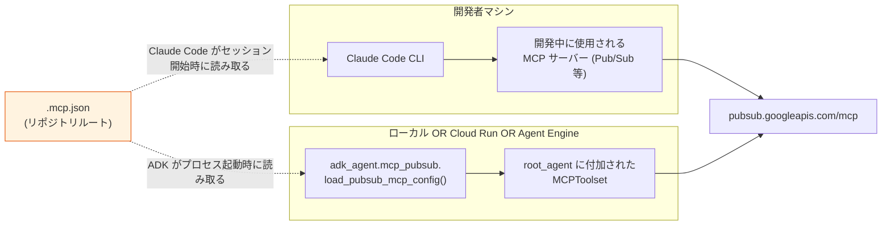
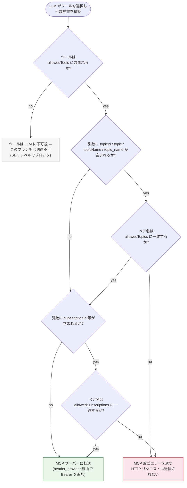

# MCP（Model Context Protocol）

本プロジェクトは MCP — [Model Context Protocol](https://modelcontextprotocol.io/) — を使用して、Pub/Sub API に直接話しかける Python コードを書くことなく、**Google Cloud Pub/Sub** をファーストクラスのツールとして ADK エージェントに提供します。Pub/Sub MCP サーバーはデフォルトで配線されている**唯一の MCP サーバー**ですが、同じ仕組みで `.mcp.json` にエントリを追加することで他のサーバーにも対応できます。

本ガイドは、このプロジェクトのコンテキストにおける MCP の概要、デフォルト拒否許可リストのセマンティクス、各デプロイモードでの `.mcp.json` の消費方法、IAM 要件、および新しい MCP サーバーの追加方法を網羅しています。

## 2 層 MCP 使用

`.mcp.json` は**2 つの独立したランタイム**によって消費されます:

| ランタイム | `.mcp.json` の用途 | タイミング |
|---|---|---|
| Claude Code（開発 CLI） | このリポジトリのローカル開発中に使用されるプロジェクトスコープの MCP サーバー。 | 開発者がこのディレクトリを Claude Code で開き、プロジェクトスコープの MCP プロンプトを承認したとき。 |
| ADK エージェント（`adk_agent/mcp_pubsub.py`） | エンドユーザーのチャットターンがパブリッシュ/リスト等できるよう、デプロイされた `LlmAgent` に付加されるランタイムツール。 | プロセス起動時、エージェントが構築されるたびに — ローカル、モード A の Cloud Run、モード B の Agent Engine で。 |

2 つのコンシューマーは**同じファイル**と**同じ許可リスト**を共有します。`.mcp.json` への変更は両方に影響します — これが設計意図です。ADK エージェントは Claude Code の MCP 内部には到達せず、Claude Code は ADK エージェントには到達しません。それぞれが独立してファイルを解析します。



## `.mcp.json` の構造

リポジトリルートのファイル:

```json
{
  "mcpServers": {
    "pubsub": {
      "type": "http",
      "url": "https://pubsub.googleapis.com/mcp",
      "headers": {
        "x-goog-user-project": "sap-advanced-workshop-gck"
      },
      "allowedTools": [
        "list_topics",
        "get_topic",
        "list_subscriptions",
        "get_subscription",
        "publish"
      ],
      "allowedTopics": ["sapphire-demo"],
      "allowedSubscriptions": ["sapphire-demo-sub"]
    }
  }
}
```

| フィールド | 必須 | 目的 |
|---|---|---|
| `mcpServers.<name>.type` | yes | `"http"` である必要がある（HTTP MCP トランスポート）。 |
| `mcpServers.<name>.url` | yes | MCP サーバーエンドポイント。デフォルトは `https://pubsub.googleapis.com/mcp`。 |
| `mcpServers.<name>.headers` | yes | すべての MCP リクエストに追加される静的ヘッダー。**`x-goog-user-project` を含める必要があります** — これは API 呼び出しに課金される GCP プロジェクトで、Pub/Sub がトピック/サブスクリプションをスコープするために使用する ID です。 |
| `mcpServers.<name>.allowedTools` | yes（デフォルト拒否） | LLM が呼び出すことを許可される MCP ツール名のホワイトリスト。**欠如または空の場合、ゼロツールが公開されます。** |
| `mcpServers.<name>.allowedTopics` | yes（デフォルト拒否） | ベアトピック名のホワイトリスト。このリスト外の `topicId`/`topic` 等の引数を持つ呼び出しは HTTP 呼び出しがエージェントを離れる前に拒否されます。 |
| `mcpServers.<name>.allowedSubscriptions` | yes（デフォルト拒否） | `allowedTopics` と同じ形状だが、サブスクリプション用。 |

**Bearer トークンは `.mcp.json` に含めません。** ファイルは git にチェックインされています。認証は実行時に取得される **Application Default Credentials（ADC）** を使用します。ADK ツールセットの `header_provider` は HTTP 交換ごとにトークンを再取得するため、トークンリフレッシュは透過的です（`adk_agent/mcp_pubsub.py:154-176`）。

## デフォルト拒否セマンティクス

3 つの独立した許可リストが、エージェント構築時と呼び出し時に強制されます:

| 許可リスト | 強制層 | 違反時の動作 |
|---|---|---|
| `allowedTools` | ADK `McpToolset(tool_filter=…)` — SDK レベル | 許可されていないツールは **LLM に通知されません**。モデルはそれを選択できません。 |
| `allowedTopics` | `before_tool_callback`（`make_pubsub_resource_gate`）— 呼び出し時の引数検査 | `{"isError": true, "content":[{"type":"text","text":"Access denied: …"}]}` で短絡。MCP サーバーには到達しません。 |
| `allowedSubscriptions` | `allowedTopics` と同じ | 同じ。 |

### ゲート決定フロー {#gate-decision-flow}



## エンドツーエンドの Pub/Sub 呼び出しフロー

ユーザーが「`sapphire-demo` に hello をパブリッシュして」と尋ね、LLM が `publish` ツールを選択した場合のイベントシーケンス:

```mermaid
sequenceDiagram
  autonumber
  participant U as ユーザー
  participant LLM as LlmAgent (root_agent)
  participant Gate as before_tool_callback (拒否ゲート)
  participant HP as header_provider
  participant ADC as Application Default Credentials
  participant MCP as pubsub.googleapis.com/mcp
  participant PubSub as Pub/Sub API

  U->>LLM: "sapphire-demo に hello をパブリッシュして"
  LLM->>LLM: ツール=publish、引数={topic:"sapphire-demo", data:"aGVsbG8="}
  LLM->>Gate: tool、args、tool_context
  Gate->>Gate: _extract_bare_name(args.topic) → "sapphire-demo"<br/>allowedTopics に含まれる? ✓
  Gate-->>LLM: 通過 (None)
  LLM->>HP: HTTP 交換のヘッダーを構築
  HP->>ADC: 無効な場合 credentials.refresh()
  ADC-->>HP: token
  HP-->>LLM: {Authorization: "Bearer …"}
  LLM->>MCP: POST /mcp {method: tools/call, params: {name: publish, …}}
  MCP->>PubSub: pubsub.projects.topics.publish
  PubSub-->>MCP: {messageIds: ["..."]}
  MCP-->>LLM: {content: [{type:"text", text:"..."}]}
  LLM-->>U: "パブリッシュ完了; messageId=..."
```

## `.mcp.json` のランタイムへの配送

ADK エージェントは `_default_mcp_config_path()` 経由でファイルを解決します:

1. `MCP_CONFIG_PATH` 環境変数（最優先）。
2. `<パッケージルート>/.mcp.json` — `adk_agent/` パッケージの場所から導出。Cloud Run で動作する方法はこれです。
3. `Path.cwd() / ".mcp.json"` — リポジトリルートから `uv run` する場合のフォールバック。

### ローカル開発

`./.mcp.json` が存在し、パッケージは `./adk_agent/`。パス解決はステップ 2（またはステップ 3）を選択します。設定不要。

### モード A — Cloud Run × 2

`adk_agent/Dockerfile` に含まれます:

```dockerfile
COPY .mcp.jso[n] ./
```

`[n]` glob はファイルが存在しない場合に黙って無操作です。パス解決は実行時にステップ 2 を選択します（`/app/.mcp.json`）。

### モード B — Vertex AI Agent Engine

`deploy/deploy-agent-engine.py` が `extra_packages=["./adk_agent", "./.mcp.json"]` でバンドルし、`MCP_CONFIG_PATH=/app/.mcp.json` を設定します。パス解決はステップ 1 を選択します。

### Pub/Sub MCP の無効化

`.mcp.json` を削除またはリネームしてください。エージェントは起動時に `mcp.pubsub.not_configured` をログに記録し、6 ではなく 5 つのベースツールのみを公開します。

## IAM 要件

| ロール | 理由 |
|---|---|
| `roles/mcp.toolUser` | `mcp.tools.call` 権限をゲートする。これなしでは MCP エンドポイントは 403 を返します。 |
| `roles/pubsub.editor`（または `pubsub.publisher`/`pubsub.subscriber`） | 実際の Pub/Sub データプレーン権限。 |

| 環境 | プリンシパル |
|---|---|
| ローカル開発 | `gcloud auth application-default login` の Google アカウント。 |
| モード A — Cloud Run | サービスアカウント `sap-rag-runner`（`deploy/deploy-cloud-run.sh` が作成）。 |
| モード B — Agent Engine | サービスアカウント `agent-engine-sa`（`deploy/setup-agent-engine.sh` が付与）。 |

## 配線の確認

```bash
# ユニット — 設定解析 + デフォルト拒否セマンティクス
uv run python -m pytest \
  adk_agent/tests/unit/test_mcp_pubsub_config.py \
  adk_agent/tests/unit/test_mcp_pubsub_gate.py -v --no-cov

# インテグレーション — root_agent が正しいツール数でインポートされる
uv run python -m pytest adk_agent/tests/unit/test_agent_smoke.py -v --no-cov

# ライブ — MCP ツールセット経由で実際にメッセージをパブリッシュ
uv run python scripts/test_pubsub_mcp_live.py
```

## 使用例

### 例 1 — トピックの一覧（許可）

```
ユーザー: Pub/Sub トピックを一覧表示して
エージェント: [tool_call] list_topics(projectId="sap-advanced-workshop-gck")
         [tool_response] {"topics": [{"name": "projects/.../topics/sapphire-demo"}]}
         トピックが 1 つあります: sapphire-demo。
```

### 例 2 — 許可されたトピックへのパブリッシュ

```
ユーザー: sapphire-demo に "hello world" をパブリッシュして
エージェント: [tool_call] publish(topic="sapphire-demo", data="aGVsbG8gd29ybGQ=")
         [tool_response] {"messageIds": ["13029384720394823"]}
         パブリッシュ完了。メッセージ ID: 13029384720394823。
```

### 例 3 — ブロックされたトピックへのパブリッシュ（拒否ゲート）

```
ユーザー: other-topic に "test" をパブリッシュして
エージェント: [tool_call] publish(topic="other-topic", data="dGVzdA==")
         [tool_response] {"isError": true,
                          "content": [{"type": "text",
                                       "text": "Access denied: 'other-topic'
                                                は allowedTopics に含まれていません"}]}
         other-topic にはパブリッシュできません。許可リストには sapphire-demo のみ含まれています。
```

### 例 4 — `.mcp.json` を削除（Pub/Sub 無効）

```
ユーザー: Pub/Sub トピックを一覧表示して
エージェント: このデプロイでは Pub/Sub ツールは利用できません。
```

## トラブルシューティング

| 症状 | 考えられる原因 | 対処法 |
|---|---|---|
| 起動時に `mcp.pubsub.not_configured` をログに記録 | `.mcp.json` が 3 つの解決パスのいずれにも見つからない。 | `MCP_CONFIG_PATH` env を確認（モード B）、またはファイルがイメージに COPY されているか確認（モード A）。 |
| 起動時に `mcp.pubsub.config_read_failed` をログに記録 | `.mcp.json` の JSON が不正形式、または必須キーが欠如。 | `python -c "import json; json.load(open('.mcp.json'))"` で検証。 |
| 起動時に `mcp.pubsub.adc_unavailable` をログに記録 | `google.auth.default()` が認証情報を見つけられない。 | ローカル: `gcloud auth application-default login`。Cloud Run: ランタイム SA を確認。 |
| HTTP 403 `permission denied on mcp.tools.call` | `roles/mcp.toolUser` がない。 | `gcloud projects add-iam-policy-binding $PROJECT_ID --member=… --role=roles/mcp.toolUser` |
| HTTP 403 `permission denied on pubsub.topics.…` | データプレーンの Pub/Sub ロールがない。 | `roles/pubsub.editor` を付与。 |
| `{"isError": true, "text": "Access denied: '…' is not in allowedTopics"}` | 拒否ゲートが一致した。 | `.mcp.json` の `allowedTopics` に値を追加して再デプロイ。 |
| Agent Engine でツール呼び出しが TLS / DNS エラーで失敗 | VPC-SC が有効でインターネットエグレスが失われている。 | VPC-SC を無効にするか、プロキシ VM を設置。 |

診断ワンライナー:

```bash
gcloud auth application-default print-access-token >/dev/null && echo OK

gcloud services list --enabled --filter="name:pubsub.googleapis.com" \
  --project $(jq -r '.mcpServers.pubsub.headers["x-goog-user-project"]' .mcp.json)

PRINCIPAL="user:$(gcloud config get account)"
gcloud projects get-iam-policy $PROJECT_ID \
  --flatten=bindings --filter="bindings.members:$PRINCIPAL" \
  --format="value(bindings.role)" | grep -E "mcp\.toolUser|pubsub"
```

## 新しい MCP サーバーの追加

1. **`.mcp.json` にエントリを追加する** — `mcpServers.<name>` に `type: "http"`、`url`、`headers`、許可リスト。
2. **`adk_agent/mcp_<name>.py` を作成する** — `mcp_pubsub.py` をモデルとしてゲートとツールセットビルダーを実装。ゲートは HTTP 呼び出しがエージェントを離れる**前**に拒否する必要があります。
3. **`adk_agent/agent.py` に配線する** — 既存の `setup_pubsub_mcp()` と並べて呼び出す。複数ゲートは `before_tool_callback=lambda …: pubsub_gate(…) or bigquery_gate(…)` でチェーン。
4. **ランタイム SA に IAM を付与する** — `roles/mcp.toolUser` は共通。各サービス固有のデータプレーンロールも必要。`deploy/` スクリプトを更新。
5. **テストを追加する** — `test_mcp_pubsub_config.py` / `test_mcp_pubsub_gate.py` と並行して。

## 注意事項

- **`.mcp.json` は git にチェックインされています。** Bearer トークン、API キー、環境ごとの URL を含めないでください。
- **Pub/Sub MCP はパブリックインターネットへの HTTPS が必要です。** Cloud Run のデフォルトエグレスは機能します。VPC-SC が有効な場合はプロキシ VM が必要です。
- **デフォルト拒否の引数ゲートは Pub/Sub 形状のみをキャッチします。** 新しい MCP サーバーには独自のゲートが必要です。

## ファイルリファレンス

| パス | ロール |
|---|---|
| `.mcp.json` | MCP ルーティング + 許可リストの唯一の真実のソース。 |
| `adk_agent/mcp_pubsub.py` | 設定ローダー、ツールセットビルダー、デフォルト拒否 `before_tool_callback`。 |
| `adk_agent/agent.py` | `setup_pubsub_mcp()` を呼び出し、バンドルを `root_agent` に付加する。 |
| `adk_agent/Dockerfile` | `COPY .mcp.jso[n] ./` — モード A 配送。 |
| `deploy/deploy-agent-engine.py` | `extra_packages` + `MCP_CONFIG_PATH` env — モード B 配送。 |
| `deploy/deploy-cloud-run.sh` | `.mcp.json` 存在時に IAM ロールを付与。 |
| `deploy/setup-agent-engine.sh` | モード B の同じロール付与。 |
| `scripts/test_pubsub_mcp_live.py` | アップストリーム MCP に対するライブスモークテスト。 |

## 参照

- [ARCHITECTURE.md §9 Pub/Sub MCP ツールセット](./ARCHITECTURE.md#9-pub-sub-mcp-ツールセット)
- [DEPLOYMENT.md §5 Pub/Sub MCP](./DEPLOYMENT.md#5-pub-sub-mcpオプション)
- [`deploy/README.md`](../../deploy/README.md)
- アップストリーム: [Google Cloud Pub/Sub MCP](https://docs.cloud.google.com/pubsub/docs/use-pubsub-mcp)
