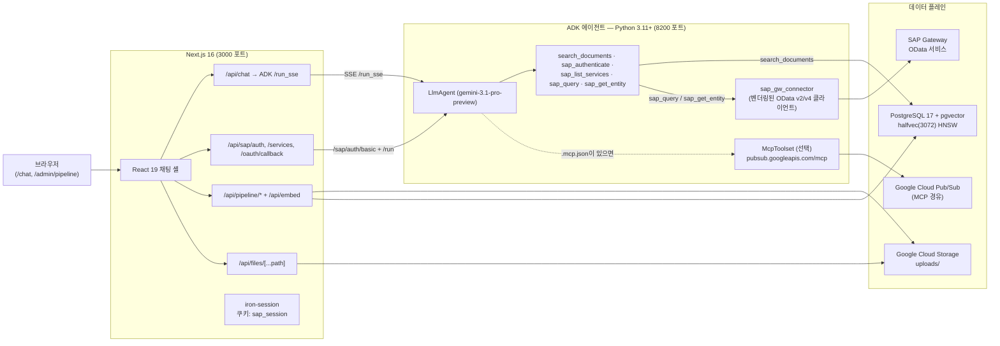
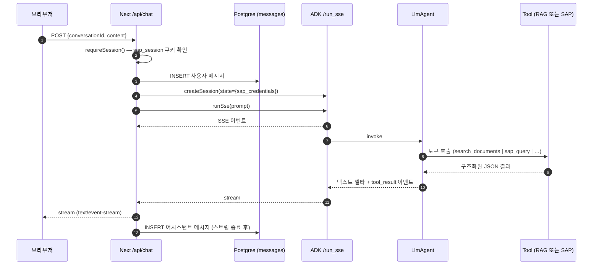
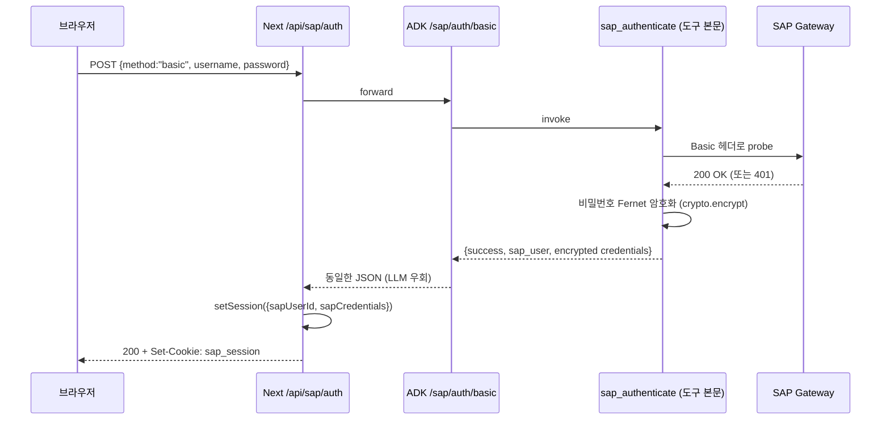
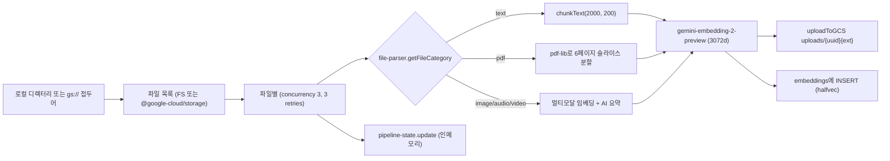
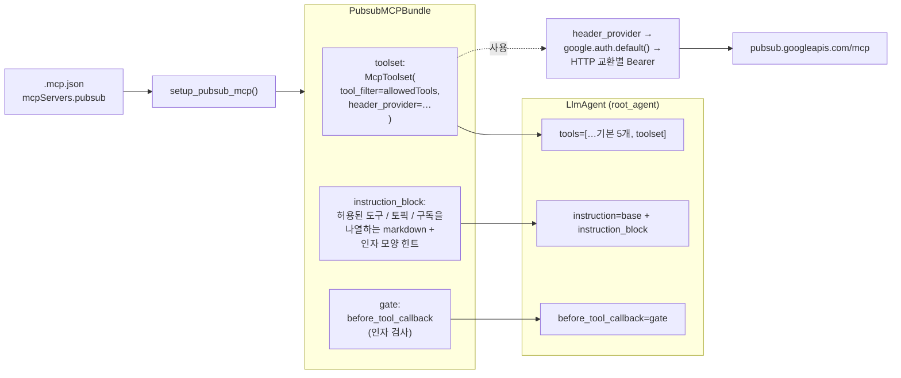
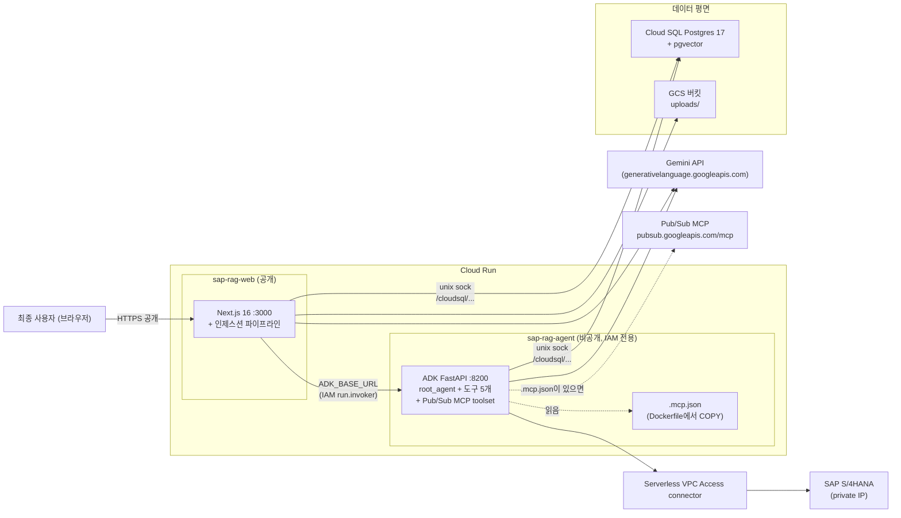
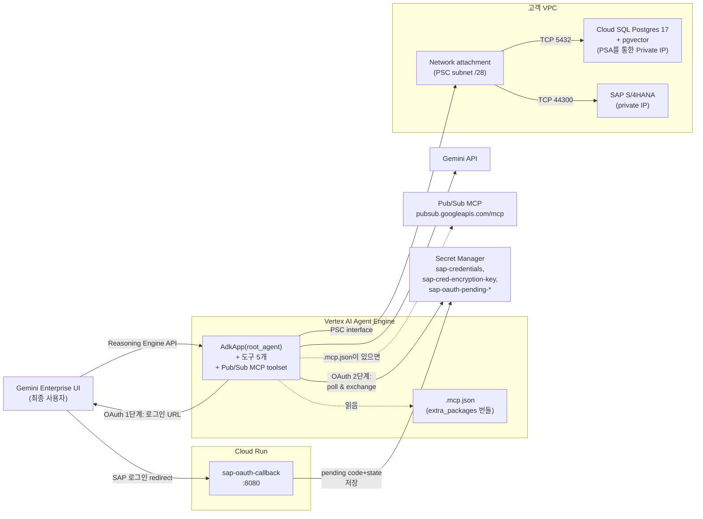

# 아키텍처

## 1. 런타임 토폴로지

두 개의 장기 실행 프로세스, 그리고 PostgreSQL과 Google Cloud Storage가
있습니다. Next.js 앱에는 **에이전트 로직이 없으며** — 모든 채팅 턴은 SSE를
통해 ADK 에이전트로 프록시됩니다.



**독립 실행형 SAP 사이드카는 없습니다.** 이전의 `sap-service/` FastAPI
프로세스(8100 포트)는 제거되었으며, SAP Gateway 호출은 이제 ADK 에이전트
안에서 벤더링된 `adk_agent/sap_gw_connector` 패키지를 통해 인프로세스로
이루어집니다.

## 2. 기술 스택 계층

| 계층 | 기술 |
|------|------|
| 채팅 UI | Next.js 16 (App Router, Turbopack), React 19, Tailwind 4, shadcn/ui |
| 스트리밍 + 인제스션 API | Next.js Route Handlers (`runtime='nodejs'`, `maxDuration` 최대 300s) |
| 에이전트 | Google ADK Python (`google-adk>=1.27`), 도구 5개를 지닌 `LlmAgent`, 선택적 MCP toolset |
| 에이전트 트랜스포트 | `google.adk.cli.fast_api.get_fast_api_app`이 빌드한 FastAPI, `/run_sse`의 SSE |
| LLM | `gemini-3.1-pro-preview` (`SAP_AGENT_MODEL`로 오버라이드) |
| 임베딩 | `gemini-embedding-2-preview` (Next.js 인제스션) 및 `gemini-embedding-001` (ADK 쿼리 경로); 둘 다 3072차원 벡터 생성 |
| 벡터 저장소 | PostgreSQL 17 + `pgvector`, `halfvec(3072)`와 HNSW 인덱스 |
| 파일 저장소 | Google Cloud Storage; traversal 가드를 갖춘 `/api/files/...`로 다시 서빙 |
| 인증 (웹) | iron-session 쿠키 `sap_session` (8시간); 별도 `sap_oauth_pending` 쿠키 (10분) |
| 인증 (SAP) | Basic 및 OAuth 2.0 + PKCE; SAP 자격증명은 `SAP_CRED_ENCRYPTION_KEY`로 Fernet 암호화되어 ADK 세션 상태에 저장 |
| 선택적 MCP | Google Cloud Pub/Sub HTTP MCP, deny-by-default allowlist |
| 로깅 | `pino` (Next) + `structlog` (ADK), JSON to file + 선택적 pretty stdout |

## 3. 데이터 흐름: 채팅 턴 (RAG 및/또는 SAP)



Next.js 계층:
- SSE 청크를 파싱하고 (`src/lib/adk-client.ts`), Gemini `parts[]`를 평탄한
  `{type: text_delta | tool_call | tool_result | error}` 이벤트 스트림으로
  정규화하며, 콘텐츠 중복을 피하기 위해 `partial:false` 집계 텍스트 프레임을
  **드롭**합니다.
- ADK 호출 전에 사용자 메시지를 영구 저장하고, 스트림 종료 후 어시스턴트
  메시지를 영구 저장합니다. 첫 턴에서 대화 제목을 자동 생성합니다.
- `sap_session` 쿠키에서 가져온 `sap_user_id`로 전체 트랜잭션의 스코프를
  지정합니다 (`src/lib/session.ts` 참조).

## 4. 데이터 흐름: SAP 인증

### 4.1 Basic 인증



Next.js로 전달되는 자격증명 blob은 평문이 아닌 Fernet 암호화된 비밀번호를
포함합니다. 이후 채팅 턴은 이를 다시 ADK 세션 상태에 시드해서
`sap_query`/`sap_get_entity`가 호출 시점에 `_client_for` 안에서 복호화하도록
합니다 (`adk_agent/tools/query_tool.py` 참조).

### 4.2 OAuth 2.0 + PKCE

```mermaid
sequenceDiagram
  participant U as 브라우저
  participant L as LlmAgent
  participant Auth as sap_authenticate
  participant SAP as SAP /oauth
  participant N as Next /api/sap/oauth/callback

  Note over U,L: 채팅 도중 LLM이 SAP 필요 + 자격증명 없음을 감지
  L->>Auth: sap_authenticate(method="oauth", user_id)
  Auth-->>L: {success:false, action_required:"sap_login", login_url, oauth_state}
  L-->>U: login_url을 그대로 노출 (시스템 프롬프트에 따라)
  U->>SAP: login_url 열고 인증
  SAP-->>U: /api/sap/oauth/callback?code&state로 리다이렉트
  U->>N: GET callback
  N->>N: state를 sap_oauth_pending 쿠키와 비교 검증
  Note over N: Step-2 토큰 교환 와이어링은 현재 TODO;<br/>콜백은 fail closed.
```

콜백 페이지(`src/app/api/sap/oauth/callback/route.ts`)는 현재 **fail closed**
상태이며 — 부모 윈도우에 실패 메시지를 포스트하는 팝업 HTML을 반환합니다.
이를 ADK Step-2 엔드포인트(`adk_agent/oauth.exchange_code`)에 와이어링하는
것은 [`docs/followups/post-migration.md`](../followups/post-migration.md)에
추적되는 열린 후속 작업입니다.

## 5. 데이터 흐름: 인제스션 파이프라인



`src/lib/embedding-ingest.ts`가 진입점이며, 이후 모든 작업은 Next.js
프로세스에서 실행됩니다. ADK 에이전트의 RAG 도구는 동일한 `embeddings`
테이블에서 읽기만 합니다 — 쓰지 않습니다.

## 6. 데이터베이스 스키마

| 테이블 | 주요 컬럼 | 비고 |
|--------|-----------|------|
| `embeddings` | `id`, `file_name`, `file_type`, `file_path`, `chunk_index`, `chunk_text`, `content_summary`, `embedding vector(3072)`, `metadata jsonb` | 코사인 검색용 HNSW halfvec 인덱스; 파일명 인지 조회용 `file_name` 인덱스 |
| `conversations` | `id`, `sap_user_id varchar(255)`, `title`, timestamps | 합성 인덱스 `(sap_user_id, updated_at desc)` — 모든 list/delete가 SAP 사용자별 스코프 |
| `messages` | `id`, `conversation_id` (FK CASCADE), `role`, `content`, `file_name`, `attachments jsonb`, `created_at` | 인덱스 `(conversation_id, created_at)` |

세 테이블 모두 `pnpm db:setup`이 생성합니다. `conversations`에
`sap_user_id` 컬럼이 없는 레거시 DB의 경우 `pnpm db:migrate:sap-user-id`을
실행하세요.

## 7. 컴포넌트 계층 (Next.js)

```
src/app/
├── layout.tsx                      # 루트 html + 폰트 와이어링
├── page.tsx                        # redirect('/chat')
├── chat/page.tsx                   # 셸: <ChatSidebar/> + <ChatWindow/> + <ChatInput/>
└── admin/pipeline/page.tsx         # <PipelineDashboard/>

src/components/
├── ChatSidebar.tsx                 # 대화 목록, new/select/delete, 로그아웃
├── ChatWindow.tsx                  # 마크다운 스트림, 복사 버튼, 첨부 그리드, 인라인 SAP 로그인 폼
├── ChatInput.tsx                   # 텍스트영역 + 클립
├── SAPDataView.tsx                 # 일반 record-array → 테이블 렌더러 (채팅 결과에서 사용)
├── PipelineDashboard.tsx           # 소스 경로 입력 + 폴더 업로드 + 상태 폴링
└── ui/                             # shadcn 프리미티브
```

## 8. ADK 에이전트 내부

```
adk_agent/
├── agent.py            # LlmAgent (모델, 시스템 프롬프트, 도구 등록 순서, before_tool_callback)
├── server.py           # build_app() → FastAPI + /healthz + /sap/auth/basic
├── settings.py         # 동결된 dataclass; REQUIRED = [DATABASE_URL, SAP_HOST, EMBED_MODEL, EMBED_OUTPUT_DIM, SAP_CRED_ENCRYPTION_KEY]
├── probes.py           # 4개의 시작 프로브 (yaml, db, embed model, secret manager)
├── mcp_pubsub.py       # Pub/Sub MCP toolset + deny-by-default before_tool_callback
├── oauth.py            # build_login_url, exchange_code (PKCE)
├── crypto.py           # Fernet singleton: encrypt(), decrypt()
├── services.yaml       # SAP 카탈로그: 4개의 OData 서비스 + entities + 키 필드
├── rag/
│   ├── db.py           # asyncpg 풀; SELECT … 1 - (embedding <=> $1::vector) AS score …
│   └── embedding.py    # genai.aio.models.embed_content (RETRIEVAL_QUERY task type)
└── tools/              # 5개의 callable; tool_context.state는 턴별로 Next.js가 시드
```

### 도구 등록 순서 (`agent.py`)

1. `search_documents`
2. `sap_authenticate`
3. `sap_list_services`
4. `sap_query`
5. `sap_get_entity`
6. *(선택)* `setup_pubsub_mcp()`이 번들을 반환하면 `McpToolset(pubsub …)`

시스템 프롬프트는 LLM에 다음을 명시적으로 지시합니다:
- 문서 질문은 `search_documents`로, SAP 질문은 `sap_query`로 라우팅
- `action_required` envelope을 그대로 노출 (그리고 `login_url`이 있으면
  사용자에게 제시)
- SAP 결과는 마크다운 테이블로 렌더링; RAG는 `source` 필드 인용

### 도구의 인증 게이팅

`tool_context.state["sap_credentials"]`이 없으면 `sap_query`와
`sap_get_entity`는 단락(short-circuit)됩니다:

```json
{ "success": false, "action_required": "sap_login", "error": "not_authenticated" }
```

`SAPAuthenticationError`(예: 만료된 토큰) 발생 시 envelope은
`action_required: "re_authenticate"`이 되어 프론트엔드가 사용자에게
재로그인을 요청할 수 있습니다. 다른 실패는 구조화된 에러 envelope을
반환합니다 ([API.md](./API.md#sap_query) 참조).

## 9. Pub/Sub MCP toolset

`.mcp.json`이 유효한 `mcpServers.pubsub` HTTP 항목을 정의하면
`adk_agent/mcp_pubsub.py:setup_pubsub_mcp()`이 `LlmAgent`의 다른 슬롯에
연결되는 세 개의 아티팩트를 가진 `PubsubMCPBundle`을 생성합니다:



- `toolset` — `McpToolset(StreamableHTTPConnectionParams, tool_filter=allowed_tools, header_provider=…)`. `header_provider`는 HTTP 교환마다 `https://www.googleapis.com/auth/pubsub` 스코프의 ADC 토큰을 요청하므로, 토큰 갱신은 투명하게 일어납니다 — toolset을 다시 빌드할 필요가 없습니다.
- `instruction_block` — 허용된 도구·토픽·구독을 나열하고 인자 모양 힌트
  (`projectId`는 평문 문자열, `publish`의 `data`는 base64 인코딩)를 포함하는
  마크다운 시스템 프롬프트 섹션. 에이전트 instruction에 연결됩니다. 이것이
  없으면 LLM은 도구 에러를 통해 규약을 발견해야 하지만, 있으면 모델은 보통
  첫 시도에 유효한 인자를 선택합니다.
- `gate` — `before_tool_callback`. 도구 인자에서 `topicId / topic / topicName
  / topic_name` (및 subscription 변형) 중 어느 것이든 검사하고,
  `_extract_bare_name`을 통해 `projects/X/topics/`와 `topics/` 접두어를
  벗긴 후 매칭되지 않는 값은
  `{"isError": true, "content":[{"type":"text","text":"Access denied: …"}]}`로
  거부합니다. 전체 평가 순서는
  [MCP.md "게이트 결정 흐름"](./MCP.md#게이트-결정-흐름) 참조.

**Deny-by-default 정책**:

| `.mcp.json` 필드 | 누락/비어 있을 때 효과 |
|------------------|----------------------|
| `allowedTools` | LLM에 노출되는 Pub/Sub 도구 0개 |
| `allowedTopics` | `topicId` 인자를 가진 모든 호출 거부 |
| `allowedSubscriptions` | `subscriptionId` 인자를 가진 모든 호출 거부 |

호출자 principal은 `roles/mcp.toolUser` (`mcp.tools.call` 권한 게이트)와
`roles/pubsub.editor` (또는 더 세분화된 Pub/Sub 역할) 모두를 보유해야
합니다. 로컬 개발에서는 `gcloud auth application-default login` 한 번이면
충분하며, Cloud Run의 경우 런타임 서비스 계정에 역할을 부여하세요.

## 10. 로깅과 요청 컨텍스트

| 프로세스 | 로거 | 파일 |
|---------|------|------|
| Next.js | pino, 선택적 `pino-pretty` stdout | `${LOG_DIR ?? './logs'}/{service}.log` |
| ADK 에이전트 | `structlog` JSON | stdout (Cloud Run / Docker가 수집) |

둘 다 `LOG_LEVEL` (`debug | info | warn | error`)과 `LOG_PAYLOAD`
(`meta | full` — SAP 응답 본문을 얼마나 캡처할지 제어)을 따릅니다.

`src/lib/request-context.ts`는 `AsyncLocalStorage`를 사용해 단일 채팅 턴
도중 발생한 모든 로그 라인에 `{requestId, conversationId}`를 부착합니다.
민감한 필드 (`Authorization`, `Set-Cookie`, `Cookie`, `access_token`,
`refresh_token`, `password`)는 `src/lib/logger.ts`의 pino 설정으로
리덕션됩니다.

## 11. 보안 아키텍처

- **세션 서명.** `iron-session`은 `SAP_SESSION_SECRET` (≥ 32자)로
  `sap_session` 및 `sap_oauth_pending` 쿠키에 서명합니다. `httpOnly`,
  `sameSite=lax`, `secure`는 프로덕션에서만.
- **저장 시 SAP 자격증명.** Basic 인증 비밀번호는 ADK 프로세스를 떠나기
  전에 `SAP_CRED_ENCRYPTION_KEY`로 Fernet 암호화됩니다. iron-session
  쿠키는 암호화된 blob을 운반하고, ADK 도구가 호출 시점에 복호화합니다.
- **GCS 프록시.** `src/lib/gcs.ts:downloadFromGCS`는 강제로 `uploads/`
  접두어를 적용하며 `..`를 포함하는 모든 경로를 거부합니다. `/api/files`
  라우트는 `Cache-Control: public, max-age=86400`로 서빙합니다.
- **CSP와 헤더.** `next.config.ts`는 엄격한 CSP, `X-Frame-Options DENY`,
  `nosniff`, HSTS 스타일 옵션을 발송합니다.
- **인증 게이트.** `.env.local`에 `REQUIRE_AUTH=true`을 설정하면
  `src/proxy.ts` (Next 16에서 미들웨어 이름 변경)가 `requireSession()`에
  추가로 프록시 계층에서 `/api/chat`, `/api/embed`, `/api/conversations`,
  `/api/pipeline/*`, `/api/files/*`, `/api/sap/services`를 게이트합니다.
  사용자가 로그인할 수 있도록 `/api/sap/auth`는 의도적으로 제외됩니다.
- **Pub/Sub allowlist.** Deny-by-default 게이트(§9 참조)가 업스트림 MCP가
  더 많이 노출하더라도 LLM이 큐레이션된 집합 외부의 토픽/구독에 접근하는
  것을 차단합니다.

## 12. 운영 노트

- 두 프로세스는 `pipeline-state.ts` (인메모리 인제스션 진행 상황, 재시작
  시 손실)와 인메모리 ADK 세션 백엔드(`ADK_SESSION_BACKEND=memory` 기본)를
  제외하면 stateless입니다. 프로덕션에서는 ADK를 `vertex`로 전환해 세션이
  복제본 전체에 걸쳐 영구 저장되도록 하세요.
- `db.ts`, `logger.ts`, `gemini.ts`, `gcs.ts`에 대한 HMR-aware 싱글턴은
  **아직 적용되지 않았습니다** — 긴 개발 세션은 Postgres 풀과 로그 스트림을
  누적합니다. CLAUDE.md에 추적됩니다.
- Predev 가드 `scripts/check-parent-workspace.mjs`는 부모 디렉터리에
  workspace marker (`package.json`, `*-lock.*`, `pnpm-workspace.yaml`)가
  나타나면 `next dev` 시작을 거부합니다 — 전체 Turbopack CSS 리졸버 버그
  스토리는 CLAUDE.md, 업스트림 드래프트는
  [`docs/issues/2026-04-29-nextjs-turbopack-css-resolver-bug.md`](../issues/2026-04-29-nextjs-turbopack-css-resolver-bug.md)
  참조.

배포 세부사항은 [DEPLOYMENT.md](./DEPLOYMENT.md), 전체 엔드포인트
페이로드는 [API.md](./API.md)를 참조하세요.

## 13. 배포 토폴로지

§1의 런타임 토폴로지는 **로컬 개발** 레이아웃을 보여줍니다. `deploy/`에는
두 가지 프로덕션 토폴로지가 스크립트로 제공됩니다. 두 모드는 하나의 Cloud
SQL Postgres + pgvector 인스턴스를 공유하며, `.mcp.json`과 MCP 토올셋이
런타임으로 전달되는 방식이 모드별로 다릅니다.

배포 스크립트와 단계별 가이드는 [`deploy/README.md`](../../deploy/README.md),
모드 전체에 걸친 MCP 와이어링은 [MCP.md](./MCP.md) 참조.

### 13.1 모드 A — Cloud Run × 2

두 서비스가 런타임이 `/cloudsql/<conn>`에 마운트하는 Unix 소켓을 통해 하나의
Cloud SQL을 공유합니다. SAP S/4HANA 비공개 IP에 도달하기 위해 VPC 커넥터가
필요한 것은 에이전트 서비스뿐입니다.



핵심 와이어링:

- `.mcp.json`은 `adk_agent/Dockerfile`에서 에이전트 이미지로 COPY됩니다
  (`COPY .mcp.jso[n] ./`). 시작 시 `_default_mcp_config_path()`의 단계 2를
  통해 `/app/.mcp.json`이 선택됩니다.
- `deploy/deploy-cloud-run.sh`는 `.mcp.json`이 있을 때 런타임 SA에
  `roles/mcp.toolUser` + `roles/pubsub.editor`를 부여합니다.
- 웹 서비스는 `--allow-unauthenticated`이고, 에이전트 서비스는 비공개로
  웹 서비스의 런타임 SA가 `roles/run.invoker`를 통해서만 접근 가능합니다.
- 웹 서비스는 **에이전트 로직을 갖지 않습니다** — `/api/chat`은 SSE를
  에이전트의 `/run_sse`로 프록시합니다.

### 13.2 모드 B — Vertex AI Agent Engine 단독

ADK 에이전트만 `vertexai.agent_engines.create()`로 배포되며, 최종 사용자가
Gemini 채팅 화면에서 대화할 수 있도록 **Gemini Enterprise**에 등록됩니다.
Next.js 측은 배포되지 않습니다.



핵심 와이어링:

- `.mcp.json`은 `deploy/deploy-agent-engine.py`가
  `extra_packages=["./adk_agent", "./.mcp.json"]`로 번들링합니다. 배포된
  환경에서는 `MCP_CONFIG_PATH=/app/.mcp.json`도 설정되어 경로 해석이
  단계 1을 선택합니다 — 가장 빠르고 파일시스템 워크가 없습니다.
- `deploy/setup-agent-engine.sh`는 `.mcp.json`이 있을 때 `agent-engine-sa`에
  `roles/mcp.toolUser` + `roles/pubsub.editor`를 부여합니다.
- 기본 Agent Engine 모드(VPC-SC 미사용)에서는 Pub/Sub MCP egress가
  작동합니다. 프로젝트에 VPC-SC가 활성화되어 있다면 공용 인터넷 MCP는
  고객 VPC에 프록시 VM이 필요합니다 ([MCP.md "주의사항"](./MCP.md#주의사항) 참조).
- Cloud SQL Private IP는 `setup-cloud-sql.sh MODE=agent-engine`이 수립한
  PSA 피어링을 통해 도달합니다. PSC interface가 같은 VPC에 부착되므로 추가
  방화벽 규칙 없이 피어링된 범위가 스코프에 포함됩니다.
- 모드 B에서 SAP 인증은 OAuth 전용입니다 — basic 인증을 중개할 Next.js
  측이 없습니다. Cloud Run 콜백 서비스가 SAP redirect를 받아
  `sap-oauth-pending-<state-prefix>` 아래의 Secret Manager에 `code`/`state`를
  영구 저장하고, 에이전트의 다음 턴이 이를 가져옵니다. (에이전트 내부의
  폴링 헬퍼는 후속 작업입니다 —
  [`deploy/README.md`](../../deploy/README.md#mode-b-oauth-flow) 참조.)
