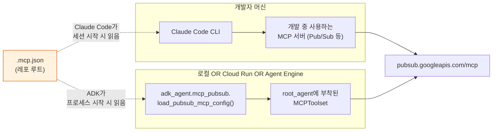
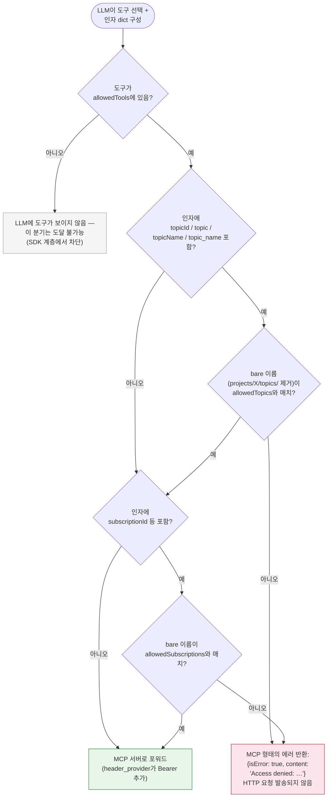

# MCP (Model Context Protocol)

이 프로젝트는 [Model Context Protocol](https://modelcontextprotocol.io/) (MCP)을
사용해 ADK 에이전트가 **Google Cloud Pub/Sub**을 마치 일급 도구처럼 사용할 수
있게 합니다 — Pub/Sub API와 직접 통신하는 Python 코드를 작성할 필요가 없습니다.
기본적으로 연결되는 MCP 서버는 **Pub/Sub MCP 하나뿐**이지만, 동일한 메커니즘으로
`.mcp.json`에 항목을 추가하기만 하면 다른 서버도 함께 사용할 수 있습니다.

이 가이드는 MCP가 이 프로젝트에서 어떤 의미를 가지는지, deny-by-default
allowlist 의미론, 각 배포 모드에서 `.mcp.json`이 어떻게 소비되는지, IAM 요건,
그리고 새 MCP 서버 추가 방법을 다룹니다.

## 두 계층의 MCP 사용

`.mcp.json`은 **두 개의 독립적인 런타임**에서 소비됩니다:

| 런타임 | `.mcp.json`을 읽는 용도 | 시점 |
|---|---|---|
| Claude Code (개발 CLI) | 이 레포의 로컬 개발 중 사용하는 프로젝트 스코프 MCP 서버. | 개발자가 이 디렉터리를 Claude Code에서 열고 프로젝트 스코프 MCP 프롬프트를 승인할 때. |
| ADK 에이전트 (`adk_agent/mcp_pubsub.py`) | 배포된 `LlmAgent`에 연결되는 런타임 도구 — 최종 사용자 채팅 턴이 publish/list 등을 수행할 수 있게. | 에이전트가 구성될 때마다 (로컬, 모드 A Cloud Run, 모드 B Agent Engine 모두). |

두 소비자는 **같은 파일**과 **같은 allowlist**를 공유합니다. `.mcp.json`을 변경하면
두 런타임 모두에 영향을 미칩니다 — 의도된 설계입니다. ADK 에이전트는 Claude Code의
MCP 배관에 손대지 않고, Claude Code도 ADK 에이전트의 배관에 손대지 않습니다 —
각자 독립적으로 파일을 파싱합니다.



## `.mcp.json`의 모양

레포 루트의 파일:

```json
{
  "mcpServers": {
    "pubsub": {
      "type": "http",
      "url": "https://pubsub.googleapis.com/mcp",
      "headers": {
        "x-goog-user-project": "sap-advanced-workshop-gck"
      },
      "allowedTools": [
        "list_topics",
        "get_topic",
        "list_subscriptions",
        "get_subscription",
        "publish"
      ],
      "allowedTopics": ["sapphire-demo"],
      "allowedSubscriptions": ["sapphire-demo-sub"]
    }
  }
}
```

| 필드 | 필수 | 목적 |
|---|---|---|
| `mcpServers.<name>.type` | yes | `"http"` (HTTP MCP 전송) 이어야 합니다. |
| `mcpServers.<name>.url` | yes | MCP 서버 엔드포인트. 기본값은 Google Cloud의 공개 Pub/Sub MCP인 `https://pubsub.googleapis.com/mcp`. |
| `mcpServers.<name>.headers` | yes | 모든 MCP 요청에 추가되는 정적 헤더. **`x-goog-user-project`를 반드시 포함해야 합니다** — API 호출 비용이 청구되는 GCP 프로젝트이자 Pub/Sub가 토픽/구독을 스코프하는 ID입니다. |
| `mcpServers.<name>.allowedTools` | yes (deny-by-default) | LLM이 호출할 수 있는 MCP 도구 이름의 화이트리스트. **없거나 비어 있으면 노출되는 도구는 0개.** |
| `mcpServers.<name>.allowedTopics` | yes (deny-by-default) | 허용된 bare 토픽 이름의 화이트리스트. 인자에 `topicId`/`topic`/`topicName`/`topic_name`이 포함된 호출이 이 목록 밖이면 HTTP 호출이 에이전트를 떠나기 전에 거부됩니다. |
| `mcpServers.<name>.allowedSubscriptions` | yes (deny-by-default) | `allowedTopics`와 같은 형태이되 구독에 대한 것. |

**Bearer 토큰은 절대 `.mcp.json`에 넣지 않습니다.** 이 파일은 git에 체크인됩니다.
인증은 런타임에 가져오는 **Application Default Credentials (ADC)**를 사용합니다
— 로컬 개발에서는 `gcloud auth application-default login`, Cloud Run /
Agent Engine에서는 런타임 서비스 계정. ADK 토올셋의 `header_provider`는 HTTP
교환마다 토큰을 다시 가져오므로 토큰 갱신은 투명하게 일어납니다
(`adk_agent/mcp_pubsub.py:154-176`).

## Deny-by-default 의미론

세 개의 독립적인 allowlist가 모두 에이전트 구성 + 호출 시점에 강제됩니다:

| Allowlist | 강제 계층 | 위반 시 동작 |
|---|---|---|
| `allowedTools` | ADK `McpToolset(tool_filter=…)` — SDK 계층 | 허용되지 않은 도구는 **LLM에 광고되지 않음**. 모델이 선택할 수 없음. |
| `allowedTopics` | `before_tool_callback` (`adk_agent/mcp_pubsub.py:make_pubsub_resource_gate`) — 호출 시점 인자 검사 | 호출이 `{"isError": true, "content":[{"type":"text","text":"Access denied: …"}]}`로 단락. MCP 서버에 도달하지 않음. |
| `allowedSubscriptions` | `allowedTopics`와 동일 | 동일. |

도구 이름 필터링과 리소스 필터링은 의도적으로 **분리된 두 게이트**입니다 —
업스트림 Pub/Sub MCP 서버에는 프로젝트 스코프 allowlist 개념이 없기 때문입니다.
`tool_filter`는 모델이 선택할 수 있는 도구만 제한하지 어떤 토픽/구독에서 작동할
수 있는지는 제한하지 않습니다. 리소스 게이트가 그 부분을 보완합니다.

인자 키 검사기는 관대합니다: 전체 리소스 경로(`projects/X/topics/Y` → `Y`)를
벗기고 네 가지 일반적인 명명 변형(`topicId`, `topic`, `topicName`, `topic_name`)을
허용합니다. `adk_agent/mcp_pubsub.py`의 `_extract_bare_name` 참조. 다른 인자
모양을 가진 새 MCP 서버를 추가한다면 그에 대응하는 게이트를 작성하세요.

### 게이트 결정 흐름

LLM이 선택한 모든 도구 호출은 HTTP 요청이 에이전트 프로세스를 떠나기 **전**에
이 평가를 거칩니다:



게이트 위반은 에이전트 프로세스를 떠나지 않으며 HTTP 라운드트립 비용도
들지 않습니다. 모델은 구조화된 에러를 보고 다음 턴에 자체 수정할 수 있습니다 —
일반적인 복구는 시스템 프롬프트에 표시된 allowlist의 토픽 이름으로 재시도하는
것입니다 (`setup_pubsub_mcp()`이 발행하는 `instruction_block`이 허용된 리소스를
열거합니다).

## 종단 간 Pub/Sub 호출 흐름

사용자가 "sapphire-demo에 hello 메시지를 publish"라고 요청하고 LLM이 `publish`
도구를 선택했을 때의 이벤트 시퀀스:

```mermaid
sequenceDiagram
  autonumber
  participant U as 사용자
  participant LLM as LlmAgent (root_agent)
  participant Gate as before_tool_callback<br/>(deny 게이트)
  participant HP as header_provider
  participant ADC as Application Default<br/>Credentials
  participant MCP as pubsub.googleapis.com/mcp
  participant PubSub as Pub/Sub API

  U->>LLM: "sapphire-demo에 hello publish"
  LLM->>LLM: 도구 선택=publish<br/>args={topic: "sapphire-demo", data: "aGVsbG8="}
  LLM->>Gate: tool, args, tool_context
  Gate->>Gate: _extract_bare_name(args.topic) → "sapphire-demo"<br/>allowedTopics에 있음? ✓
  Gate-->>LLM: pass-through (None)
  LLM->>HP: HTTP 교환을 위한 헤더 빌드
  HP->>ADC: !valid이면 credentials.refresh(AuthRequest())
  ADC-->>HP: token
  HP-->>LLM: {x-goog-user-project: …, Authorization: "Bearer …"}
  LLM->>MCP: POST /mcp { method: tools/call, params: {name: publish, arguments: …} }
  MCP->>PubSub: pubsub.projects.topics.publish (caller=ADC principal)
  PubSub-->>MCP: { messageIds: ["..."] }
  MCP-->>LLM: { content: [{type: "text", text: "..."}] }
  LLM-->>U: "Published; messageId=..."
```

이 다이어그램이 보여주는 핵심 속성:

- **게이트가 먼저 실행됨** (단계 3–5). 차단된 호출은 단계 5를 넘어가지 않으며,
  토큰을 가져오지 않고 HTTPS 요청도 만들지 않습니다.
- **토큰 freshness는 교환별** (단계 6–8). 모든 MCP 호출마다 `header_provider`가
  호출되므로, 만료된 ADC 토큰은 투명하게 갱신됩니다 — 토올셋 자체는 다시
  빌드되지 않습니다.
- **MCP 서버가 IAM 강제 지점** (단계 10). 게이트가 우회되더라도 업스트림
  Pub/Sub API가 여전히 principal의 역할에 대해 bearer 토큰을 검증합니다.
  게이트는 유일한 장벽이 아니라 다층 방어입니다.

## `.mcp.json`이 런타임에 전달되는 방식

ADK 에이전트는 `adk_agent/mcp_pubsub.py:_default_mcp_config_path()`를 통해
파일을 해석합니다:

1. `MCP_CONFIG_PATH` 환경 변수 (최우선).
2. `<package root>/.mcp.json` — `cwd()`가 아닌 `adk_agent/` 패키지 위치에서 유도.
   Cloud Run에서 작동하는 방식.
3. `Path.cwd() / ".mcp.json"` — 레포 루트에서 `uv run`을 위한 레거시 fallback.

이는 **각 배포 모드가 파일을 다르게 전달함**을 의미합니다:

### 로컬 개발 (`uv run python -m adk_agent.server`)

파일은 `./.mcp.json`이고 패키지는 `./adk_agent/`. 경로 해석은 단계 2 (또는
단계 3 — 둘 다 같은 파일을 가리킴)를 선택합니다. 설정할 것 없음.

### 모드 A — Cloud Run × 2

`adk_agent/Dockerfile`에 다음을 포함합니다:

```dockerfile
COPY .mcp.jso[n] ./
```

후행 `[n]` 글로브는 `.mcp.json`이 존재하면 매치하고, 없으면 조용히 no-op이 됩니다
— 이 파일을 포함하지 않은 fork에서도 빌드가 깨지지 않습니다. 런타임에서는 단계
2 (`/app/.mcp.json` — `/app/adk_agent/`의 형제)가 선택됩니다.

`deploy/deploy-cloud-run.sh`도 이 파일이 있는지 감지하여 `roles/mcp.toolUser` +
`roles/pubsub.editor`를 런타임 SA에 추가합니다.

### 모드 B — Vertex AI Agent Engine

`deploy/deploy-agent-engine.py`는 `extra_packages=["./adk_agent", "./.mcp.json"]`로
파일을 번들링하고 배포 환경에 `MCP_CONFIG_PATH=/app/.mcp.json`을 설정합니다.
런타임에서는 단계 1이 선택되어 Agent Engine이 번들에서 추출한 파일을 가리킵니다.

### Pub/Sub MCP 비활성화

Pub/Sub 지원 **없이** 실행하려면 `.mcp.json`을 삭제하거나 이름을 변경하세요.
에이전트는 시작 시 `mcp.pubsub.not_configured`를 한 번 로깅하고 6개가 아닌 5개의
기본 도구(RAG + 4 SAP)만 노출합니다. 다른 변경 사항은 없습니다.

## IAM 요건

궁극적으로 `pubsub.googleapis.com/mcp`를 호출하는 principal은 **두 역할**을
모두 가져야 합니다:

| 역할 | 이유 |
|---|---|
| `roles/mcp.toolUser` | `mcp.tools.call` 권한을 게이트. 이것 없이는 API 호출 모양이 유효해도 MCP 엔드포인트가 403을 반환합니다. |
| `roles/pubsub.editor` (또는 더 세분화된 `pubsub.publisher`/`pubsub.subscriber`) | 실제 Pub/Sub 데이터 평면 권한. MCP 서버가 호출자를 대신해 Pub/Sub API로 포워드. |

| 환경 | Principal |
|---|---|
| 로컬 개발 | `gcloud auth application-default login`의 Google 계정. |
| 모드 A — Cloud Run | 서비스 계정 `sap-rag-runner` (`.mcp.json`이 있을 때 `deploy/deploy-cloud-run.sh`가 생성/바인딩). |
| 모드 B — Agent Engine | 서비스 계정 `agent-engine-sa` (`.mcp.json`이 있을 때 `deploy/setup-agent-engine.sh`가 동일한 역할 부여). |

`.mcp.json`의 `x-goog-user-project`는 **Pub/Sub API가 활성화되어 있고** 호출하는
principal이 인식되는 프로젝트를 가리켜야 합니다:

```bash
gcloud services enable pubsub.googleapis.com --project sap-advanced-workshop-gck
```

## 와이어링 검증

세 가지 테스트가 경로를 커버합니다:

```bash
# 단위 테스트 — 설정 파싱 + deny-by-default 의미론
uv run python -m pytest \
  adk_agent/tests/unit/test_mcp_pubsub_config.py \
  adk_agent/tests/unit/test_mcp_pubsub_gate.py -v --no-cov

# 통합 — root_agent가 올바른 도구 개수로 임포트되는지 확인
uv run python -m pytest adk_agent/tests/unit/test_agent_smoke.py -v --no-cov
# len(root_agent.tools)가 5 (Pub/Sub 없음) 또는 6 (Pub/Sub 있음)인지 단언

# 라이브 — MCP 토올셋을 통해 실제로 메시지 발행
uv run python scripts/test_pubsub_mcp_live.py
# x-goog-user-project에 sapphire-demo 토픽 + 구독이 있어야 합니다.
# MCP 경로를 통한 업로드를 확인합니다; 도착은 다음 명령으로 대역 외에서 검증:
#   gcloud pubsub subscriptions pull sapphire-demo-sub
```

## 사용 예제

MCP 토올셋이 부착된 후의 채팅 세션 모습. 에이전트의 시스템 프롬프트에는
`setup_pubsub_mcp()`의 `instruction_block`이 포함되어 허용된 도구/토픽/구독을
나열하므로, LLM은 사용자가 명시할 필요 없이 유효한 인자를 선택합니다.

### 예제 1 — 토픽 목록 조회 (허용)

```
사용자: 우리 Pub/Sub 토픽 뭐 있어?
에이전트: [tool_call] list_topics(projectId="sap-advanced-workshop-gck")
         [tool_response] {"topics": [{"name": "projects/.../topics/sapphire-demo"}]}
         토픽이 하나 있습니다: sapphire-demo.
```

`list_topics`는 `topicId` 인자를 갖지 않으므로 deny-gate가 첫 번째 결정에서
단락됩니다 (리소스 인자 없음 → 그대로 통과). 도구 자체는 `allowedTools`에 있습니다.

### 예제 2 — 허용된 토픽에 publish

```
사용자: sapphire-demo에 "hello world" publish 해줘
에이전트: [tool_call] publish(topic="sapphire-demo", data="aGVsbG8gd29ybGQ=")
         [tool_response] {"messageIds": ["13029384720394823"]}
         발행 완료. Message ID: 13029384720394823.
```

LLM이 페이로드를 base64로 인코딩한 점에 주목 — 이 규약은 `instruction_block`에
문서화되어 있어 모델이 도구 에러 없이 첫 시도에 올바르게 처리합니다.

### 예제 3 — 차단된 토픽에 publish (deny gate 발동)

```
사용자: other-topic에 "test" publish
에이전트: [tool_call] publish(topic="other-topic", data="dGVzdA==")
         [tool_response] {"isError": true,
                          "content": [{"type": "text",
                                       "text": "Access denied: 'other-topic'
                                                is not in allowedTopics"}]}
         other-topic에는 publish할 수 없습니다 — 에이전트의 allowlist에는
         sapphire-demo만 포함됩니다. 그쪽으로 시도해볼까요?
```

MCP 서버는 호출되지 않았습니다. 구조화된 에러는 LLM이 같은 차단된 호출을
반복하는 대신 우아하게 복구할 수 있도록 (허용된 값 제안) 충분한 컨텍스트를
제공합니다.

### 예제 4 — `.mcp.json` 삭제 (Pub/Sub 비활성화)

```
사용자: Pub/Sub 토픽 목록 보여줘
에이전트: 이 배포에서는 Pub/Sub 도구를 사용할 수 없습니다.
         (시작 시 에이전트는 `mcp.pubsub.not_configured`를 로깅합니다.)
```

`.mcp.json`이 없으면 LLM은 `list_topics` / `publish` 등을 도구 surface에서
보지 못하므로 평문 "할 수 없음" 응답으로 fallback합니다.

## 문제 해결

| 증상 | 가능한 원인 | 해결 |
|---|---|---|
| 에이전트는 시작되지만 `mcp.pubsub.not_configured`를 로깅 | 3개의 해석 경로 어디에서도 `.mcp.json`을 찾지 못함. | `MCP_CONFIG_PATH` 환경 (모드 B) 또는 파일이 이미지에 COPY되었는지 (모드 A) 확인. 로컬 개발에서는 레포 루트에서 실행하거나 `MCP_CONFIG_PATH=$PWD/.mcp.json` 설정. |
| 에이전트는 시작되지만 `mcp.pubsub.config_read_failed`를 로깅 | `.mcp.json`은 있지만 JSON이 잘못되었거나 `mcpServers.pubsub` 블록이 필수 키 (`type`, `url`, `headers.x-goog-user-project`) 누락. | `python -c "import json; json.load(open('.mcp.json'))"`로 검증; 위의 스키마 표와 교차 확인. |
| 에이전트는 시작되지만 `mcp.pubsub.adc_unavailable`를 로깅 | `google.auth.default()`가 자격 증명을 찾지 못함. | 로컬 개발: `gcloud auth application-default login`. Cloud Run / Agent Engine: 런타임 SA가 존재하고 서비스에 부착되어 있는지 확인. |
| MCP가 HTTP 403 `permission denied on mcp.tools.call` 반환 | 호출자에게 `roles/mcp.toolUser` 누락. | 프로젝트에 부여: `gcloud projects add-iam-policy-binding $PROJECT_ID --member=… --role=roles/mcp.toolUser`. |
| MCP가 HTTP 403 `permission denied on pubsub.topics.…` 반환 | 호출자에게 데이터 평면 Pub/Sub 역할 누락. | `roles/pubsub.editor` (또는 더 세분화된 것) 부여. |
| MCP가 HTTP 401 / 토큰 갱신 루프 반환 | ADC 토큰이 거부됨 — 일반적으로 `x-goog-user-project`가 호출자가 접근할 수 없는 프로젝트를 가리키거나, 그 프로젝트에서 Pub/Sub API가 활성화되지 않음. | `gcloud services enable pubsub.googleapis.com --project <x-goog-user-project>`와 `gcloud projects describe <x-goog-user-project>`로 접근 확인. |
| 도구 호출이 `{"isError": true, "text": "Access denied: '…' is not in allowedTopics"}` 반환 | deny-gate 매치. | `.mcp.json`의 `allowedTopics`에 값을 추가하고 재배포하거나, 사용자에게 허용된 토픽을 사용하도록 안내. 에러 텍스트는 항상 위반 값을 명시. |
| 테스트에서 `len(root_agent.tools) == 6`이 아닌 `5` | Pub/Sub MCP가 로드되지 않음 — 위의 처음 세 행과 동일한 근본 원인. `test_agent_smoke.py` 단언은 두 값을 모두 받아들이지만, `LOG_LEVEL=debug`로 실행하고 `mcp.pubsub`을 grep해서 조사 가능. | 위의 처음 세 행 참조. |
| Agent Engine 배포는 성공하지만 도구 호출이 TLS / DNS 에러로 실패 | 프로젝트에 VPC-SC가 활성화됨; private 모드의 Agent Engine은 기본 인터넷 egress를 잃어 `pubsub.googleapis.com`에 도달할 수 없음. | 프로젝트의 VPC-SC를 비활성화하거나, Cloud NAT를 가진 프록시 VM을 VPC에 세우고 MCP 트래픽을 그쪽으로 라우팅 (아래 주의사항 참조). |
| 라이브 테스트 `scripts/test_pubsub_mcp_live.py`가 "publishing"에서 hang | MCP 서버는 요청을 수락했지만 토픽이 존재하지 않음. | `gcloud pubsub topics create sapphire-demo --project <x-goog-user-project>` 와 `gcloud pubsub subscriptions create sapphire-demo-sub --topic sapphire-demo`. |

진단 한 줄 명령:

```bash
# ADC가 설정되어 있고 예상한 principal로 해석되는지 확인
gcloud auth application-default print-access-token >/dev/null && echo OK

# x-goog-user-project가 가리키는 프로젝트에서 Pub/Sub API가 활성화되어 있는지 확인
gcloud services list --enabled --filter="name:pubsub.googleapis.com" \
  --project $(jq -r '.mcpServers.pubsub.headers["x-goog-user-project"]' .mcp.json)

# 호출자에게 두 필수 역할이 모두 바인딩되어 있는지 확인
PRINCIPAL="user:$(gcloud config get account)"   # 또는 serviceAccount:…
gcloud projects get-iam-policy $PROJECT_ID \
  --flatten=bindings --filter="bindings.members:$PRINCIPAL" \
  --format="value(bindings.role)" | grep -E "mcp\.toolUser|pubsub"
```

## 새 MCP 서버 추가하기

현재 `adk_agent/mcp_pubsub.py`는 **Pub/Sub 전용**입니다 — Pub/Sub 인자 모양
(`topicId`, `subscriptionId`, …)을 알고 Pub/Sub 풍의 deny-by-default 게이트를
강제합니다. 두 번째 MCP 서버 (예: BigQuery)를 추가한다면, 자체 게이트를 가진
형제 모듈 `adk_agent/mcp_<service>.py`를 작성하고 `adk_agent/agent.py`에서 두
`setup_<service>_mcp()` 함수 모두를 호출하는 것이 자연스럽습니다.

구체적인 단계:

1. **`.mcp.json`의 `mcpServers.<name>` 아래에 항목 추가** — 같은 모양:
   `type: "http"`, `url`, `headers` (`x-goog-user-project` 포함), 그리고 강제하고
   싶은 서비스별 allowlist.
2. **`mcp_pubsub.py`를 모델로 `adk_agent/mcp_<name>.py` 생성**:
   `load_<name>_mcp_config`, `build_<name>_toolset`, `make_<name>_resource_gate`,
   번들을 반환하는 `setup_<name>_mcp`. 게이트는 HTTP 호출이 에이전트를 떠나기
   **전**에 거부해야 합니다 — GCP 측 IAM이 추측할 수 없는 유일한 곳입니다.
3. **`adk_agent/agent.py`에 기존 `setup_pubsub_mcp()` 호출 옆에 와이어링.**
   각 번들이 자체 toolset, instruction block, `before_tool_callback`을 기여합니다.
   여러 게이트를 합성하려면 단일
   `before_tool_callback=lambda …: pubsub_gate(…) or bigquery_gate(…)`로 체인.
4. **런타임 SA에 IAM 부여**: `roles/mcp.toolUser`는 서버에 무관하지만 각 MCP는
   자체 데이터 평면 역할이 필요 — 예: BigQuery MCP는 `roles/bigquery.dataEditor`.
   `deploy/deploy-cloud-run.sh`와 `deploy/setup-agent-engine.sh`를 그에 맞게 업데이트.
5. **`test_mcp_pubsub_config.py` / `test_mcp_pubsub_gate.py`와 평행한 테스트
   추가.** `test_agent_smoke.py`의 도구 개수 단언도 업데이트가 필요할 수 있습니다.

## 주의사항

- **`.mcp.json`은 git에 체크인됩니다.** Bearer 토큰, API 키, 환경별 URL을 넣지
  마세요. **비-비밀 라우팅 + allowlist 전용으로**만 사용하고, 자격 증명은
  ADC / 런타임 SA에 의존하세요.
- **Pub/Sub MCP는 공용 인터넷으로의 HTTPS가 필요합니다.** Cloud Run의 기본
  egress는 작동합니다. 모드 B의 PSC-interface 모드는 프로젝트에 VPC-SC가
  활성화되어 있지 **않은** 한 기본 인터넷 egress를 유지합니다 ([Agent Engine
  네트워킹 문서](https://cloud.google.com/vertex-ai/generative-ai/docs/agent-engine/private-service-connect-interface)
  참조). VPC-SC를 켜면 `pubsub.googleapis.com`에 도달하기 위해 VPC에 프록시
  VM이 필요합니다.
- **deny-by-default 인자 게이트는 Pub/Sub 모양의 호출만 잡습니다.** 새 MCP
  서버는 자체 게이트가 필요합니다; `mcp_pubsub.py`를 복사하는 것이 가장 쉬운
  경로입니다.

## 파일 참조

| 경로 | 역할 |
|---|---|
| `.mcp.json` | MCP 라우팅 + allowlist의 단일 진실 공급원. |
| `adk_agent/mcp_pubsub.py` | 설정 로더, toolset 빌더, deny-by-default `before_tool_callback`. |
| `adk_agent/agent.py` | `setup_pubsub_mcp()`을 호출하고 번들을 `root_agent`에 부착. |
| `adk_agent/Dockerfile` | `COPY .mcp.jso[n] ./` — 모드 A 전달. |
| `deploy/deploy-agent-engine.py` | `extra_packages=[…, "./.mcp.json"]` + `MCP_CONFIG_PATH` 환경 — 모드 B 전달. |
| `deploy/deploy-cloud-run.sh` | `.mcp.json`이 있을 때 `roles/mcp.toolUser` + `roles/pubsub.editor` 부여. |
| `deploy/setup-agent-engine.sh` | 모드 B에서 같은 역할 부여. |
| `scripts/test_pubsub_mcp_live.py` | 업스트림 MCP에 대한 라이브 스모크 테스트. |
| `CLAUDE.md` (Runtime Pub/Sub MCP 섹션) | Cloud Run 런타임 기대치 노트. |

## 참고

- [ARCHITECTURE.md §9 Pub/Sub MCP toolset](./ARCHITECTURE.md#9-pub-sub-mcp-toolset)
  — 리소스 게이트와 toolset 구성의 내부.
- [DEPLOYMENT.md §5 Pub/Sub MCP](./DEPLOYMENT.md#5-pub-sub-mcp-선택)
  — 운영 / IAM 체크리스트.
- [`deploy/README.md`](../../deploy/README.md) — MCP 와이어링을 통합한 모드별
  배포 가이드.
- 업스트림: [Google Cloud Pub/Sub MCP](https://docs.cloud.google.com/pubsub/docs/use-pubsub-mcp).
